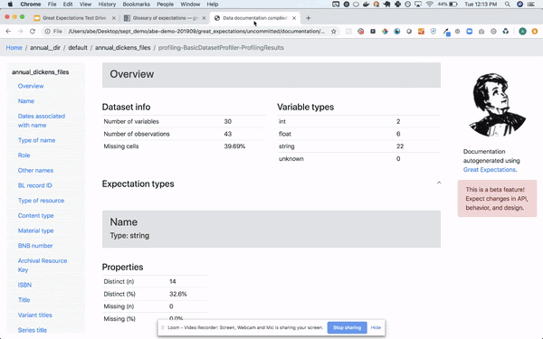

[](https://travis-ci.org/great-expectations/great_expectations)
[](https://coveralls.io/github/great-expectations/great_expectations?branch=develop)
[](http://great-expectations.readthedocs.io/en/latest/?badge=latest)

<!-- <<<Super-quickstart links go here>>> -->


Great Expectations
================================================================================

*Always know what to expect from your data.*

Introduction
--------------------------------------------------------------------------------

Great Expectations helps data teams eliminate pipeline debt, through data testing, documentation, and profiling.

Software developers have long known that testing and documentation are essential for managing complex codebases. Great Expectations brings the same confidence, integrity, and acceleration to data science and data engineering teams.

See [Down with Pipeline Debt!](https://medium.com/@expectgreatdata/down-with-pipeline-debt-introducing-great-expectations-862ddc46782a) for an introduction to the philosophy of pipeline testing.


<!--
--------------------------------------------------
<<<A bunch of logos go here for social proof>>>

--------------------------------------------------
-->

Key features
--------------------------------------------------

**Expectations**

Expectations are assertions for data. They are the workhorse abstraction in Great Expectations, covering all kinds of common data issues, including:
- `expect_column_values_to_not_be_null`
- `expect_column_values_to_match_regex`
- `expect_column_values_to_be_unique`
- `expect_column_values_to_match_strftime_format`
- `expect_table_row_count_to_be_between`
- `expect_column_median_to_be_between`
- ...and [many more](https://docs.greatexpectations.io/en/latest/expectation_glossary.html)

Expectations are <!--[declarative, flexible and extensible]()--> declarative, flexible and extensible.
<!--To test out Expectations on your own data, check out the [<<step-1 tutorial>>]().-->

<!--
<<animated gif showing typing an Expectation in a notebook cell, running it, and getting an informative result>>
-->

**Batteries-included data validation**

Expectations are a great start, but it takes more to get to production-ready data validation. Where are Expectations stored? How do they get updated? How do you securely connect to production data systems? How do you notify team members and triage when data validation fails?

Great Expectations supports all of these use cases out of the box. Instead of building these components for yourself over weeks or months, you will be able to add production-ready validation to your pipeline in a day. This “Expectations on rails” framework plays nice with other data engineering tools, respects your existing name spaces, and is designed for extensibility.

<!--
Check out [The Era of DIY Data Validation is Over]() for more details.
-->

<!--
<<animated gif showing slack message, plus click through to validation results, a la: https://docs.google.com/presentation/d/1ZqFXsoOyW2KIkMBNij3c7KOM0RhajhAHKesdCL_BKHw/edit#slide=id.g6b0ff79464_0_183>>
-->


**Tests are docs and docs are tests** <span style="color:red">&#183; This feature is in alpha
</span>

Many data teams struggle to maintain up-to-date data documentation. Great Expectations solves this problem by rendering Expectations directly into clean, human-readable documentation. 

Since docs are rendered from tests, and tests are run against new data as it arrives, your documentation is guaranteed to never go stale. Additional renderers allow Great Expectations to generate other type of "documentation", including <!--[slack notifications](), [data dictionaries](), [customized notebooks]()--> slack notifications, data dictionaries, customized notebooks, etc.

<!--
<<Pic, similar to slide 32: https://docs.google.com/presentation/d/1ZqFXsoOyW2KIkMBNij3c7KOM0RhajhAHKesdCL_BKHw/edit#slide=id.g6af8c4cd70_0_38>>

<<Pic, showing an Expectation that renders a graph>>

Check out [Down with Documentation Rot!]() for more details.
-->


**Automated data profiling**

Wouldn't it be great if your tests could write themselves? Run your data through one of Great Expectations' data profilers and it will automatically generate Expectations and data documentation. Profiling provides the double benefit of helping you explore data faster, and capturing knowledge for future documentation and testing.

<!--
<<<pretty pics of profiled data>>>
<<<esp. multi-batch profiling>>>
-->


Automated profiling doesn't replace domain expertise&mdash;you will almost certainly tune and augment your auto-generated Expectations over time&mdash;but it's a great way to jump start the process of capturing and sharing domain knowledge across your team.

<!--
<<<Note: this feature is still in early beta. Expect changes.>>>

Visit our gallery of expectations and documentation generated via automatic data profiling [here]().

You can also test out profiling on your own data [here]().
-->

**Pluggable and extensible**

Every component of the framework is designed to be extensible: Expectations, storage, profilers, renderers for documentation, actions taken after validation, etc.  This design choice gives a lot of creative freedom to developers working with Great Expectations.

Recent extensions include:
* [Renderers for data dictionaries](https://greatexpectations.io/blog/20191004_data_dictionary_plugin)
* [BigQuery and GCS integration](https://github.com/great-expectations/great_expectations/pull/841)
* [Notifications to MatterMost](https://github.com/great-expectations/great_expectations/issues/902)

We're very excited to see what other plugins the data community comes up with!

Quick start
-------------------------------------------------------------

To see Great Expectations in action on your own data:

```
    pip install great_expectations
    great_expectations init

```

(We recommend deploying within a virtual environment. If you’re not familiar with pip, virtual environments, notebooks, or git, you may want to check out the [Supporting Resources](http://docs.greatexpectations.io/en/latest/reference/supporting_resources.html) will teach you how to get up and running in minutes before continuing.)

For full documentation, visit [Great Expectations on readthedocs.io](http://great-expectations.readthedocs.io/en/latest/).

If you need help, hop into our [Slack channel](https://greatexpectations.io/slack)&mdash;there are always contributors and other users there.

<!--
-------------------------------------------------------------
<<<More social proof: pics and quotes of power users>>>

-------------------------------------------------------------
-->

Integrations
-------------------------------------------------------------------------------
Great Expectations works with the tools and systems that you're already using with your data, including:

<table>
	<thead>
		<tr>
			<th colspan="2">Integration</th>
			<th>Notes</th>
		</tr>
	</thead>
	<tbody>
		<tr><td style="text-align: center; height=40px;">                                    </td><td style="width: 200px;">Pandas                   </td><td>Great for in-memory machine learning pipelines!</td></tr>
		<tr><td style="text-align: center; height=40px;">                             </td><td style="width: 200px;">Spark                    </td><td>Good for really big data.</td></tr>
		<tr><td style="text-align: center; height=40px;">          </td><td style="width: 200px;">Postgres                 </td><td>Leading open source database</td></tr>
		<tr><td style="text-align: center; height=40px;"></td><td style="width: 200px;">BigQuery</td><td>Google serverless massive-scale SQL analytics platform</td></tr>
		<tr><td style="text-align: center; height=40px;"></td><td style="width: 200px;">Databricks</td><td>Managed Spark Analytics Platform</td></tr>
		<tr><td style="text-align: center; height=40px;">                       </td><td style="width: 200px;">MySQL                    </td><td>Leading open source database</td></tr>
		<tr><td style="text-align: center; height=40px;">                 </td><td style="width: 200px;">AWS Redshift             </td><td>Cloud-based data warehouse</td></tr>
		<tr><td style="text-align: center; height=40px;">   </td><td style="width: 200px;">AWS S3                   </td><td>Cloud based blob storage</td></tr>
		<tr><td style="text-align: center; height=40px;"> </td><td style="width: 200px;">Snowflake                </td><td>Cloud-based data warehouse</td></tr>
		<tr><td style="text-align: center; height=40px;"></td><td style="width: 200px;">Apache Airflow           </td><td>An open source orchestration engine</td></tr>
		<tr><td style="text-align: center; height=40px;">                                         </td><td style="width: 200px;">Other SQL Relational DBs </td><td>Most RDBMS are supported via SQLalchemy</td></tr>
		<tr><td style="text-align: center; height=40px;">                                             </td><td style="width: 200px;">Jupyter Notebooks        </td><td>The best way to build Expectations</td></tr>
		<tr><td style="text-align: center; height=40px;">            </td><td style="width: 200px;">Slack                    </td><td> Get automatic data quality notifications!</td></tr>
	</tbody>
</table>


<!--
Quick start
-------------------------------------------------------------

Still getting comfortable with the concept of Expectations? Try [our online browser]()

Ready to start working with Great Expectations?

`great expectations init`

Looking at production deployment? [Go here]()

-------------------------------------------------------------
<<<More social proof: pics and quotes of power users>>>

-------------------------------------------------------------
Liking what you see? Show some love and give us a star!
-->


What does Great Expectations _not_ do?
-------------------------------------------------------------

**Great Expectations is _not_ a pipeline execution framework.**

We aim to integrate seamlessly with DAG execution tools like [Spark]( https://spark.apache.org/), [Airflow](https://airflow.apache.org/), [dbt]( https://www.getdbt.com/), [prefect](https://www.prefect.io/), [dagster]( https://github.com/dagster-io/dagster), [Kedro](https://github.com/quantumblacklabs/kedro), etc. We DON'T execute your pipelines for you.

**Great Expectations is _not_ a data versioning tool.**
	
Great Expectations does not store data itself. Instead, it deals in metadata about data: Expectations, validation results, etc. If you want to bring your data itself under version control, check out tools like: [DVC](https://dvc.org/) and [Quilt](https://github.com/quiltdata/quilt).

**Great Expectations currently works best in a python/bash environment.** 

Following the philosophy of "take the compute to the data," Great Expectations currently supports native execution of Expectations in three environments: pandas, SQL (through the SQLAlchemy core), and Spark. That said, all orchestration in Great Expectations is python-based. You can invoke it from the command line without using a python programming environment, but if you're working in another ecosystem, other tools might be a better choice. If you're running in a pure R environment, you might consider [assertR](https://github.com/ropensci/assertr) as an alternative. Within the Tensorflow ecosystem, [TFDV](https://www.tensorflow.org/tfx/guide/tfdv) fulfills a similar function as Great Expectations.


Who maintains Great Expectations?
-------------------------------------------------------------

Great Expectations is under active development by James Campbell, Abe Gong, Eugene Mandel, Rob Lim, Taylor Miller, with help from many others.

What's the best way to get in touch with the Great Expectations team?
--------------------------------------------------------------------------------

If you have questions, comments, or just want to have a good old-fashioned chat about data pipelines, please hop on our public [Slack channel](https://greatexpectations.io/slack)

If you'd like hands-on assistance setting up Great Expectations, establishing a healthy practice of data testing, or adding functionality to Great Expectations, please see options for consulting help [here](https://greatexpectations.io/consulting/).

Can I contribute to the library?
--------------------------------------------------------------------------------

Absolutely. Yes, please. Start [here](https://github.com/great-expectations/great_expectations/blob/develop/CONTRIBUTING.md) and please don't be shy with questions.
