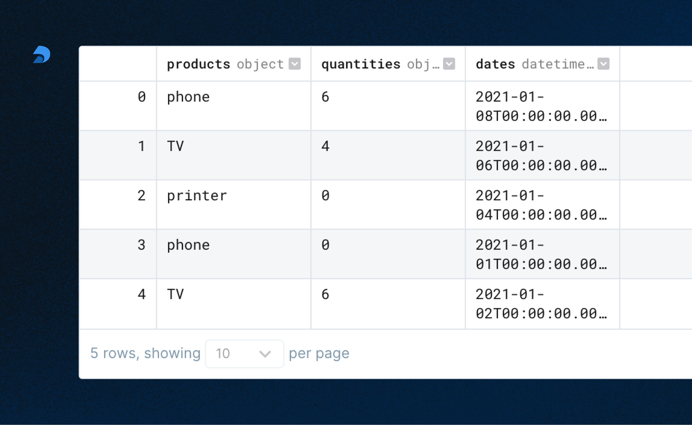
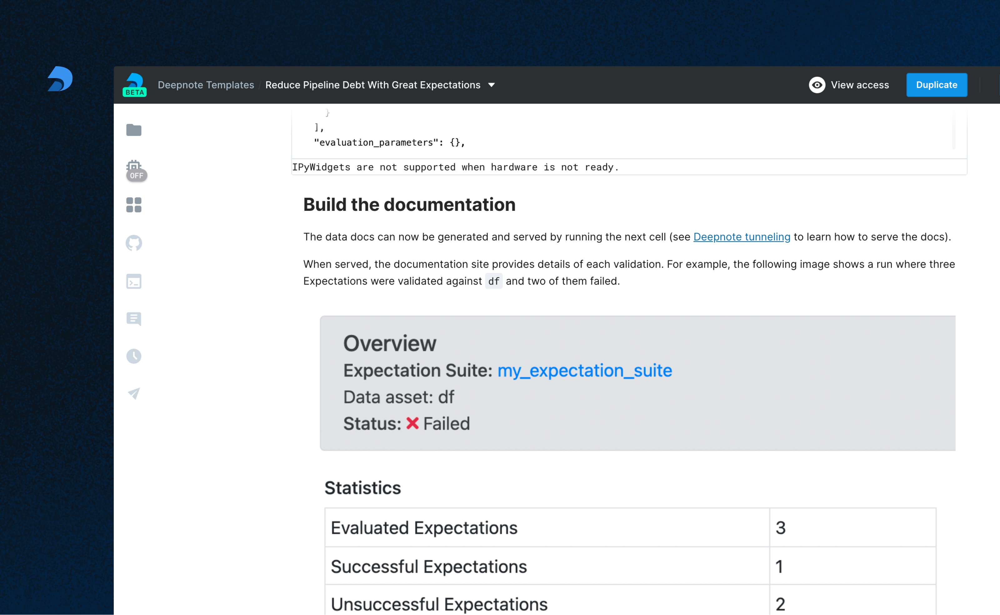

import Prerequisites from './components/deployment_pattern_prerequisites.jsx'

_This piece of documentation was authored by [Allan Campopiano](https://www.linkedin.com/in/allan-campopiano-703394120)._

This guide will help you get started with Great Expectations on Deepnote. You will learn how to validate columns in a Pandas DataFrame, 
host your data docs, and schedule a pipeline job.

All of this will be accomplished from within a single, [ready-to-use notebook](https://deepnote.com/project/Reduce-Pipeline-Debt-With-Great-Expectations-d78cwK3GRYKU7AAl9fO7lg/%2Fnotebook.ipynb/#00000-85c6538f-6aaa-427b-9eda-29fdacf56457), 
with no prerequisites beyond signing up for a [free Deepnote account](https://deepnote.com/)!

### Benefits of Great Expectations in Deepnote

Deepnote provides a "click and play" notebook platform that integrates perfectly with Great Expectations. 
You can read all about it in [this blog post](https://deepnote.com/blog/how-not-to-draw-an-owl-cky1yda1c784x0b30j4ktcok7)!

Here are some of the notable benefits:
- Great Expectation's features are demonstrated in a [single notebook](https://deepnote.com/project/Reduce-Pipeline-Debt-With-Great-Expectations-d78cwK3GRYKU7AAl9fO7lg/%2Fnotebook.ipynb/#00000-85c6538f-6aaa-427b-9eda-29fdacf56457) (no terminal needed)
- Data Docs can be [hosted publicly on Deepnote](https://docs.deepnote.com/environment/incoming-connections) (no need to host them yourself)
- [Deepnote scheduling](https://docs.deepnote.com/features/scheduling) allows you to experience Great Expectations as part of a pipeline

These benefits make Deepnote one of the easiest and fastest ways to get started with Great Expectations.

## Steps

### 1. Begin by importing Great Expectations

Since Great Expectations can be listed in Deepnote's `requirements.txt`, it will be installed automatically. You can read more about package installation [here](https://docs.deepnote.com/environment/python-requirements). 
This lets us import the required libraries right away.

```python
import pandas as pd
import numpy as np
import great_expectations as ge
from great_expectations.data_context.types.base import (
    DataContextConfig,
    DatasourceConfig,
    FilesystemStoreBackendDefaults,
)
from great_expectations.data_context import BaseDataContext
from great_expectations.checkpoint import SimpleCheckpoint
from great_expectations.core.batch import RuntimeBatchRequest
```

### 2. Initialize Great Expectations

The following cell creates a Great Expectations folder in the filesystem
which will hold all of the forthcoming project configurations. Note that if this folder already exists, Great Expectations gracefully allows us to continue.

```bash
!great_expectations --yes --v3-api init
```

### 3. Validate a Pandas DataFrame

In practice, this is where you would bring in your own data; however, for the sake of a placeholder, 
a DataFrame with random values is created. The Expectations we set later on this data may pass or fail.

:::note
Replace the randomly created DataFrame below with your own datasource.
:::

```python
import pandas as pd

products = np.random.choice(
    [
        "camera",
        "phone",
        "computer",
        "speaker",
        "TV",
        "cable",
        "movie",
        "guitar",
        "printer",
    ],
    size=5,
)

quantities = np.random.choice(list(range(10)) + [None], size=5)

dates = np.random.choice(pd.date_range(start="2020-12-30", end="2021-01-08"), size=5)

df = pd.DataFrame({"products": products, "quantities": quantities, "dates": dates})

df.show()
```





### 4. Define Expectations

Expectations can be defined directly on a Pandas DataFrame using `ge.from_pandas(df)`. 
We're defining three Expectations on our DataFrame:

1. The `products` column must contain unique values
2. The `quantities` column cannot contain null values
3. The `dates` column must have dates between January 1st and January 8th

These Expectations together form an Expectation Suite that will be validated against our data.

:::tip
Replace the sample Expectations below with those that relate to your data.

You can see all the Expectations available in the [gallery](https://greatexpectations.io/expectations).
:::

```python
df = ge.from_pandas(df)

# ~30% chance of passing
df.expect_column_values_to_be_unique("products") # ~30% chance of passing

# ~60% chance of passing
df.expect_column_values_to_not_be_null("quantities") # ~60% chance of passing

# ~60% chance of passing
df.expect_column_values_to_be_between(
    "dates", "2021-01-01", "2021-01-8", parse_strings_as_datetimes=True
);
```

### 5. Set project configurations

Before we can validate our expectations against our data, we need to tell Great Expectations more about our project's configuration. 
Great Expectations keeps track of many configurations with a [Data Context](../reference/data_context.md). 
These configurations are used to manage aspects of your project behind the scenes.

:::info
There's a lot going on here, but for the sake of this guide we don't need to worry about the full details.

To learn more, visit the [Great Expectations docs](https://docs.greatexpectations.io/docs/).
:::

```python
data_context_config = DataContextConfig(
    datasources={
        "my_datasource": DatasourceConfig(
            class_name="Datasource",
            module_name="great_expectations.datasource",
            execution_engine={
                "class_name": "PandasExecutionEngine",
                "module_name": "great_expectations.execution_engine",
            },
            data_connectors={
                "default_runtime_data_connector_name": {
                    "class_name": "RuntimeDataConnector",
                    "batch_identifiers": ["default_identifier_name"],
                }
            },
        )
    },
    store_backend_defaults=FilesystemStoreBackendDefaults(
        root_directory="/work/great_expectations"
    ),
)

context = BaseDataContext(project_config=data_context_config)
context.save_expectation_suite(
    expectation_suite_name="my_expectation_suite",
    expectation_suite=df.get_expectation_suite(discard_failed_expectations=False),
);
```

### 6. Setting up a Batch and Checkpoint

In order to populate the documentation ([Data Docs](../reference/data_docs.md)) for our tests, 
we need to set up at least one [Batch](../reference/datasources.md#batches) and a [Checkpoint](../reference/checkpoints_and_actions.md). 

A Batch is a pairing of data and metadata to be validated. A Checkpoint is a bundle of at least:
- One Batch (the data to be validated)
- One Expectation Suite (our Expectations for that data)
- One [Action](../reference/checkpoints_and_actions.md#validation-actions) (saving our validation results, rebuilding Data Docs, sending a Slack notification, etc.)

In the cell below, one Batch is constructed from our DataFrame with a [RuntimeBatchRequest](../reference/datasources.md#runtimedataconnector-and-runtimebatchrequest). 

We then create a Checkpoint, and pass in our `batch_request`. 

When we execute this code, our Expectation Suite is run against our data, validating whether that data meets our 
Expectations or not. The results are then persisted temporarily until we build our Data Docs.

```python
batch_request = RuntimeBatchRequest(
    datasource_name="my_datasource",
    data_connector_name="default_runtime_data_connector_name",
    data_asset_name="df",
    runtime_parameters={"batch_data": df},
    batch_identifiers={"default_identifier_name": "df"},
)

checkpoint_config = {
    "name": "my_checkpoint",
    "config_version": 1,
    "class_name": "SimpleCheckpoint",
    "expectation_suite_name": "my_expectation_suite",
}

context.add_checkpoint(**checkpoint_config)

results = context.run_checkpoint(
    checkpoint_name="my_checkpoint",
    validations=[{"batch_request": batch_request}],
    run_id="my_run_id",
)
```

### 7. Build the documentation

Our Data Docs can now be generated and served (thanks to [Deepnote Tunneling](https://docs.deepnote.com/environment/incoming-connections)!) by running the next cell.

```python
context.build_data_docs();
 
# Uncomment this line to serve up the documentation
#!python -m http.server 8080 --directory great_expectations/uncommitted/data_docs/local_site
```

When served, the Data Docs site provides the details of each [Validation](../terms/validation_result.md) we've run and Expectation Suite we've created.

For example, the following image shows a run where three Expectations were validated against our DataFrame and two of them failed.





<div style={{"text-align":"center"}}>
<p style={{"color":"#8784FF","font-size":"1.4em"}}><b>
Congratulations!<br/>&#127881; You've successfully deployed Great Expectations on Deepnote! &#127881;
</b></p>
</div>

## Summary

Deepnote integrates perfectly with Great Expectations, allowing documentation to be hosted and notebooks to be scheduled. Please visit [Deepnote](https://deepnote.com/) 
to learn more about how to bring tools, teams, and workflows together.
