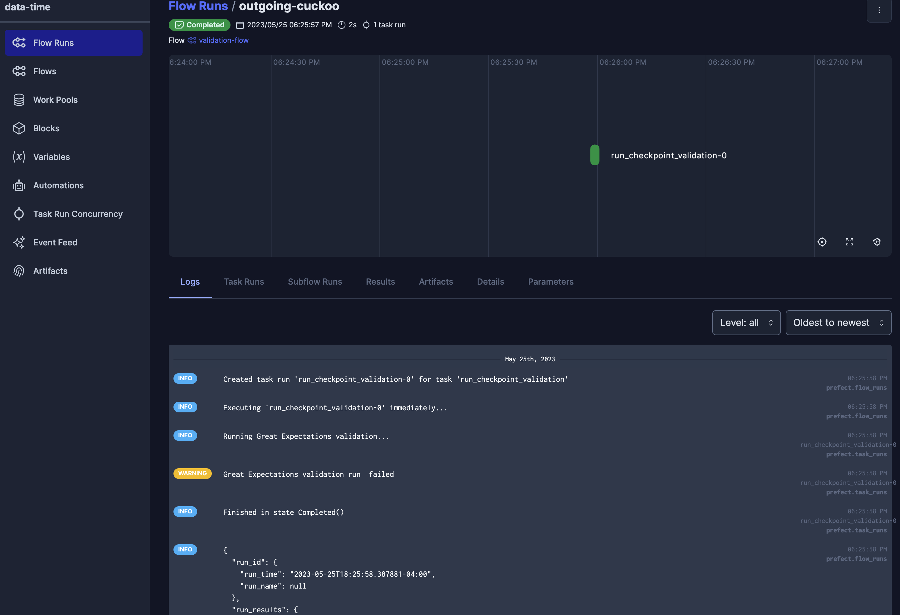
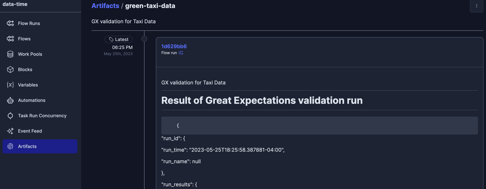

import Prerequisites from './components/deployment_pattern_prerequisites.jsx'

import InProgress from '/docs/components/warnings/_in_progress.md'

<InProgress />

This guide will help you run Great Expectations with [Prefect](https://prefect.io/)

## Prerequisites

<Prerequisites>

- None

</Prerequisites>

[Prefect](https://prefect.io/) is a workflow orchestration and observation platform that enables data engineers, ML engineers, and data scientists to stop wondering about their workflows. [The Prefect open source library](https://docs.prefect.io) allows users to create workflows using Python and add retries, logging, caching, scheduling, failure notifications, and much more. [Prefect Cloud](https://www.prefect.io/cloud/) offers all that goodness plus a hosted platform, automations, and enterprise features for users who need them. Prefect Cloud provides free and paid tiers.

Prefect can be used with Great Expectations validations so that you can be confident about the state of your data. With a Prefect [deployment](https://docs.prefect.io/latest/concepts/deployments/), you can productionize your workflow and run data quality checks in reaction to the arrival of new data or on a schedule. 

## Doing it

### Install 

Install the Great Expectations, Prefect, and [prefect-great-expectations](https://prefecthq.github.io/prefect-great-expectations/) libraries into the same Python virtual environment. 

```bash
pip install great_expectations prefect prefect_great_expectations
```

If you have any issues installing Prefect, check out the [Prefect installation docs](https://docs.prefect.io/latest/getting-started/installation/).

### Create an Expectation Suite and Checkpoint

Here's an example of a script to create an Expectation Suite and Checkpoint. This script is based on the [Great Expectations Quickstart](https://docs.greatexpectations.io/docs/tutorials/quickstart/). 

```python
import great_expectations as gx

def create_expectation_suite_and_checkpoint():
    """Create a DataContext, connect to data, create Expectations, create and return a checkpoint."""

    context = gx.get_context()

    validator = context.sources.pandas_default.read_csv(
        "https://raw.githubusercontent.com/great-expectations/gx_tutorials/main/data/yellow_tripdata_sample_2019-01.csv"
    )
    validator.expect_column_values_to_not_be_null("pickup_datetime")

    # this expectation will fail
    validator.expect_column_values_to_be_between(
        "passenger_count", min_value=1, max_value=5
    )

    # checkpoints are reusble and only need to be created once
    checkpoint = gx.checkpoint.SimpleCheckpoint(
        name="taxi_check",
        data_context=context,
        validator=validator,
    )

    return checkpoint
```

### Create a Prefect flow

Like Great Expectations, Prefect is a Pythonic framework. In Prefect, you bring your Python code and sprinkle in [task](https://docs.prefect.io/latest/concepts/flows/l) and [flow](https://docs.prefect.io/latest/concepts/flows/) decorators to gain observation and orchestration capabilities. 

Let's add a second function that we'll decorate with a Prefect `flow` decorator. Our flow function uses the `run_checkpoint_validation` task from the `prefect_great_expectations` library. This prebuilt function is a Prefect task that runs a Great Expectations validation. The `run_checkpoint_validation` can take a Great Expectations checkpoint as an argument. 

```python
from prefect import flow
from prefect_great_expectations import run_checkpoint_validation

@flow
def validation_flow(checkpoint):
    """Creates a task that validates a run of a Great Expectations checkpoint"""
    res = run_checkpoint_validation(checkpoint=checkpoint)
    return 
```

Finally in our script, let's call our functions.

```python
if __name__ == "__main__":
    checkpoint = create_expectation_suite_and_checkpoint()
    validation_flow(checkpoint=checkpoint)
```

Note that the second expectation will fail because the `passenger_count` column has some `6` values in the data. That's intentional so that we can see a failure example. Here's the output in our terminal window. 

```bash
Calculating Metrics: 100%|███████████████████████████████████████████████████████| 8/8 [00:00<00:00, 696.31it/s]
18:00:41.816 | INFO    | prefect.engine - Created flow run 'unyielding-husky' for flow 'validation-flow'
18:00:43.847 | INFO    | Flow run 'unyielding-husky' - Created task run 'run_checkpoint_validation-0' for task 'run_checkpoint_validation'
18:00:43.849 | INFO    | Flow run 'unyielding-husky' - Executing 'run_checkpoint_validation-0' immediately...
18:00:44.786 | INFO    | Task run 'run_checkpoint_validation-0' - Running Great Expectations validation...
Calculating Metrics: 100%|█████████████████████████████████████████████████████| 15/15 [00:00<00:00, 730.49it/s]
18:00:45.057 | WARNING | Task run 'run_checkpoint_validation-0' - Great Expectations validation run  failed
18:00:45.057 | ERROR   | Task run 'run_checkpoint_validation-0' - Encountered exception during execution:
...
    raise GreatExpectationValidationError(result)
prefect_great_expectations.validation.GreatExpectationValidationError: Great Expectations Validation failed. Check result on this exception for more details.
18:00:46.423 | ERROR   | Task run 'run_checkpoint_validation-0' - Finished in state Failed('Task run encountered an exception: prefect_great_expectations.validation.GreatExpectationValidationError: Great Expectations Validation failed. Check result on this exception for more details.\n')
18:00:46.424 | ERROR   | Flow run 'unyielding-husky' - Encountered exception during execution:
18:00:46.916 | ERROR   | Flow run 'unyielding-husky' - Finished in state Failed('Flow run encountered an exception. prefect_great_expectations.validation.GreatExpectationValidationError: Great Expectations Validation failed...
```

### Avoid raising an exception on validation failure

If we want to avoid raising an exception when the validation fails, we can set the `raise_on_result` argument to `False` in the `run_checkpoint_validation` task. 

```python
@flow
def validation_flow(checkpoint):
    """Creates a task that validates a run of a Great Expectations checkpoint"""
    res = run_checkpoint_validation(
        checkpoint=checkpoint, raise_on_validation_failure=False
    )
    return
```

Now when we run our script we don't get an exception. 

```bash
Calculating Metrics: 100%|████████████████████████████████████████████████████████████████████████████████████████████| 6/6 [00:00<00:00, 667.26it/s]
Calculating Metrics: 100%|████████████████████████████████████████████████████████████████████████████████████████████| 8/8 [00:00<00:00, 691.02it/s]
18:06:03.007 | INFO    | prefect.engine - Created flow run 'affable-malamute' for flow 'validation-flow'
18:06:03.624 | INFO    | Flow run 'affable-malamute' - Created task run 'run_checkpoint_validation-0' for task 'run_checkpoint_validation'
18:06:03.626 | INFO    | Flow run 'affable-malamute' - Executing 'run_checkpoint_validation-0' immediately...
18:06:03.880 | INFO    | Task run 'run_checkpoint_validation-0' - Running Great Expectations validation...
Calculating Metrics: 100%|██████████████████████████████████████████████████████████████████████████████████████████| 15/15 [00:00<00:00, 729.08it/s]
18:06:04.138 | WARNING | Task run 'run_checkpoint_validation-0' - Great Expectations validation run  failed
18:06:04.298 | INFO    | Task run 'run_checkpoint_validation-0' - Finished in state Completed()
18:06:04.401 | INFO    | Flow run 'affable-malamute' - Finished in state Completed('All states completed.')
```

For more information about the `run_checkpoint_validation` task, refer to the [prefect-great-expectations documentation](https://prefecthq.github.io/prefect-great-expectations/validation/).

### Log prints for more information

In the example above, we don't see all the relevant info for our validation failure. Let's print information about our validation results and log that information by passing `log_prints=True` to the `flow` decorator. 

```python
@flow(log_prints=True)
def validation_flow(checkpoint):
    """Creates a task that validates a run of a Great Expectations checkpoint"""
    res = run_checkpoint_validation(
        checkpoint=checkpoint, raise_on_validation_failure=False
    )
    print(res)
    return
```

Now we can see lots of relevant information in our terminal window, including the following. 

```bash
...
 "partial_unexpected_counts": [
    {
        "value": 6,
        "count": 20
    } 
...
```

Looks like we have 20 rows with a `6` in the `passenger_count` column.

### Add artifacts  

If we fire up a locally hosted Prefect server or log in to our Prefect Cloud account, we can see the same information in the Prefect UI. In addtion, if we log in to Prefect Cloud we can create an artifact to share with our Prefect workspace collaborators. Let's do that now.

1. Head over to https://app.prefect.cloud/ and sign up for a free account or log in to your existing account.
1. Authenticate your command line client with `prefect cloud login`. 
1. Create an artifact to share your Great Expectations validation results with your collaborators. 

Prefect [artifacts](https://docs.prefect.io/latest/concepts/artifacts/) will persist the validation results from a flow run and display them in the UI. Let's create a Markdown artifact with the validation results.

```python
from prefect.artifacts import create_markdown_artifact

@flow(log_prints=True)
def validation_flow(checkpoint):
    """Creates a task that validates a run of a Great Expectations checkpoint"""
    res = run_checkpoint_validation(
        checkpoint=checkpoint, raise_on_validation_failure=False
    )

    create_markdown_artifact(
        f"""# Result of Great Expectations validation run
         
        {res}
        """,
        description="GX validation for Taxi Data",
        key="green-taxi-data",
    )

    return
```

The UI gives you lots of visibilty into the state of your flow runs. 



Your artifact displays validation results for human consumption.



Alternatively, you could share a link to your [Great Expectations Data Docs](https://docs.greatexpectations.io/docs/guides/setup/configuring_data_docs/how_to_host_and_share_data_docs_on_amazon_s3) in an artifact. 

## Wrap
You've seen how to use Prefect with Great Expectations. 

### Where to go from here

Prefect [deployments](https://docs.prefect.io/latest/concepts/deployments/) allow you to run your flow in response to events such as the arrival of new data. You can also run on many types of schedules and on the infrastructure of your choice.

There's lots more to explore for additional observability and orchestration with [Prefect](https://docs.prefect.io/latest/).

Happy engineering!