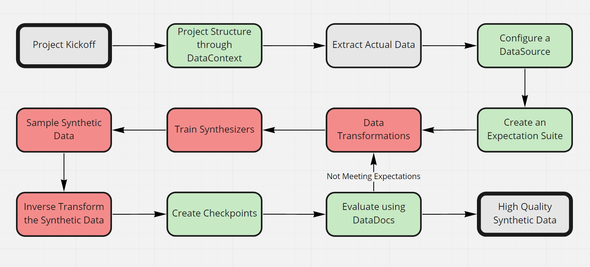
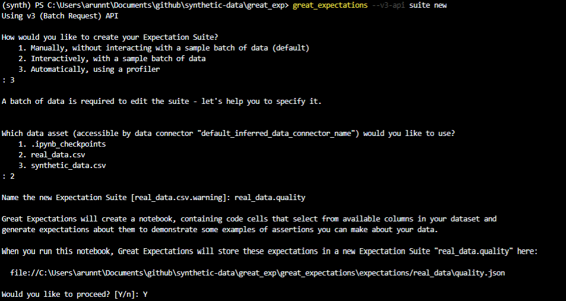

import Prerequisites from './components/deployment_pattern_prerequisites.jsx'
import TechnicalTag from '@site/docs/term_tags/_tag.mdx';

import InProgress from '@site/docs/components/warnings/_in_progress.md'

<InProgress />

_This piece of documentation was authored by [Arunn Thevapalan](https://www.linkedin.com/in/arunn-thevapalan/)._

[YData-Synthetic](https://github.com/ydataai/ydata-synthetic) is an open-source synthetic data engine. Using different kinds of Generative Adversarial Networks (GANS), the engine learns patterns and statistical properties of original data. It can create endless samples of synthetic data that resemble the original data.

This guide will help you get started on generating synthetic data using `ydata-synthetic` and validate the quality of the synthetic data against your original data using Great Expectations.

### Why use Great Expectation with ydata-synthetic?

Synthetic data replicate the statistical components of real data without containing any identifiable information, ensuring individuals' privacy. It helps solves most data science problems by providing valuable high-quality data at scale. 

As much as preserving the statistical properties of the original data is crucial, ensuring it follows a rigid data quality standard is essential too. Without a rigid data quality framework, generating synthetic data may lose its purpose: high-quality data at scale.

Great Expectations allows the user to create <TechnicalTag tag="expectation" text="Expectations" /> based on a good sample of data and use these Expectations to validate if the new data meets the data quality standards.

## The data problem we're solving in this tutorial

In this tutorial, we pick a use-case example of [“The Credit Card Fraud Dataset — Synthesizing the Minority Class.”](https://colab.research.google.com/github/ydataai/ydata-synthetic/blob/master/examples/regular/gan_example.ipynb) We aim to synthesize the minority class of the credit card fraud dataset with a high imbalance.

We will solve this problem by generating synthetic data using `ydata-synthetic` and validating it through Great Expectations. [This Jupyter Notebook](https://github.com/ydataai/ydata-synthetic/blob/dev/examples/regular/integrate_great_expectations.ipynb) can be used to follow along this tutorial with the relevant codes.



## Steps

### Step 0: Install the required libraries.

We recommend you create a virtual environment and install `ydata-synthetic` and `great-expectations` by running the following command on your terminal.

```bash
pip install ydata-synthetic great-expectations
```
### Step 1: Set up the project structure through a Data Context.

In Great Expectations, your <TechnicalTag tag="data_context" text="Data Context" /> manages the project configuration. There are multiple ways to create the Data Context; however, the simplest one is by using the CLI that comes along when you install the `great_expectations` package.

Open your terminal and navigate to the project directory and type in the following:

```bash
great_expectations init
```
Press enter to complete the creation of the Data Context, and that’s about it.

### Step 2: Download/Extract the actual data set we use to create synthetic data.

We can [download](https://www.kaggle.com/mlg-ulb/creditcardfraud) the data we use for this example from Kaggle. If you inspect the classes, you’ll notice that the “fraud” class is much lesser than the “not fraud” class, which is the case in real life.

After downloading, let's extract the minority class and use that filtered data for synthesis and validation.

```python
import pandas as pd

# Read the original data
data = pd.read_csv('./data/creditcard.csv')

#Filter the minority class
train_data = data.loc[ data['Class']==1 ].copy()

# Inspect the shape of the data
print(train_data.shape)

# Write to the data folder
train_data.to_csv('./data/creditcard_fraud.csv', index=False)
```

### Step 3: Configure a Data Source to connect our data.

In Great Expectations, <TechnicalTag tag="datasource" text="Datasources" /> simplify connections by managing configuration and providing a consistent, cross-platform API for referencing data.

Let’s configure our first Datasource: a connection to the data directory we’ve provided in the repo. Instead, this could even be a database connection and more.

```python
great_expectations datasource new
```


As shown in the image above, you would be presented with different options. Select `Files on a filesystem (for processing with Pandas or Spark)` and `Pandas`. Finally, enter the directory as `data` (where we have our actual data).

Once you’ve entered the details, a Jupyter Notebook will open up. This is just the way Great Expectations has given templated codes, which helps us create Expectations with a few code changes.

Let’s change the Datasource name to something more specific.

Edit the second code cell as follows: `datasource_name = "data__dir"`

Then execute all cells in the notebook to save the new Datasource. If successful, the last cell will print a list of all Datasources, including the one you just created.

### Step 4: Create an Expectation Suite using the built-in Great Expectations profiler.

The idea here is that we assume that the actual data has the ideal quality of the data we want to be synthesized, so we use the actual data to create a set of Expectations which we can later use to evaluate our synthetic data.

The CLI will help create our first <TechnicalTag tag="expectation_suite" text="Expectation Suite" />. Suites are simply collections of Expectations. We can use the built-in <TechnicalTag tag="profiler" text="profiler" /> to automatically generate an Expectation Suite called `creditcard.quality`.

Type the following into your terminal:
```bash
great_expectations suite new
```


Again, select the options as shown in the image above. We create Expectations using the automatic profiler and point it to use the actual dataset.

Another Jupyter Notebook would be opened with boilerplate code for creating a new Expectation Suite. The code is pretty standard; however, please note that all columns are added to the list of ignored columns in the second cell. We want to validate every column in our example; hence we should remove these columns from the `ignored_columns` list.

Executing the notebook will create an Expectation Suite against the actual credit card fraud dataset.

### Step 5: Transform the real data for modelling.

Now that we have created the Expectation Suite, we shift our focus back to creating the synthetic data.

We follow the standard process of transforming the data before training the GAN. We’re applying `PowerTransformation` — make data distribution more Gaussian-like.

```python
import pandas as pd
from sklearn.preprocessing import PowerTransformer
from sklearn.pipeline import Pipeline
from sklearn.compose import ColumnTransformer

def transformations(data):
   #Log transformation to Amount variable
    processed_data = data.copy()
    data_cols = list(data.columns[data.columns != 'Class'])

    data_transformer = Pipeline(steps=[
        ('PowerTransformer', PowerTransformer(method='yeo-johnson', standardize=True, copy=True))])

    preprocessor = ColumnTransformer(
        transformers = [('power', data_transformer, data_cols)])
    processed_data[data_cols] = preprocessor.fit_transform(data[data_cols])

    return data, processed_data, preprocessor
    
_, data, preprocessor = transformations(data)
```
Feel free to experiment with more pre-processing steps as it will yield better results.

### Step 6: Train the synthesizers and create the model.

Since we have pre-processed our data, it’s time to put our advanced `ydata-synthetic` GAN models to work.

```python
from ydata_synthetic.synthesizers.regular import WGAN_GP
from ydata_synthetic.synthesizers import ModelParameters, TrainParameters

# Define the GAN and training parameters
noise_dim = 32
dim = 128
batch_size = 128

log_step = 100
epochs = 500
learning_rate = 5e-4
beta_1 = 0.5
beta_2 = 0.9
models_dir = './cache'
model = WGAN_GP 

#Setting the GAN model parameters and the training step parameters
gan_args = ModelParameters(batch_size=batch_size,
                           lr=learning_rate,
                           betas=(beta_1, beta_2),
                           noise_dim=noise_dim,
                           n_cols=train_sample.shape[1],
                           layers_dim=dim)

train_args = TrainParameters(epochs=epochs,
                             sample_interval=log_step)

# Training the GAN model chosen: Vanilla GAN, CGAN, DCGAN, etc.
synthesizer = model(gan_args, n_critic=2)
synthesizer.train(train_sample, train_args)
```
For this example, we train a kind of GAN, called [WGAN-GP](https://arxiv.org/abs/1704.00028) which provides much-needed training stability.

### Step 7: Sample synthetic data from the synthesizer.

Since we have built our model, now it’s time to sample the required data by feeding noise. The beauty of this step is you can keep generating data as much as you want. This step is powerful when you want to generate different copies of data that are shareable and sellable.

In our case, we generate an equal number of samples as the actual data.

```python
# use the same shape as the real data
synthetic_fraud = synthesizer.sample(492)
```

### Step 8: Inverse transform the data to obtain the original format.

Here we notice that the generated synthetic data is still on the transformed form and needs to be inverse-transformed to the original structure.
```python
synthetic_data = inverse_transform(synthetic_fraud , preprocessor)
```
### Step 9: Create a new Checkpoint to validate the synthetic data against the real data.

For the regular usage of Great Expectations, the best way to <TechnicalTag tag="validate" text="validate" /> data is with a <TechnicalTag tag="checkpoint" text="Checkpoint" />. Checkpoints bundle Batches of data with corresponding Expectation Suites for validation.

From the terminal, run the following command:
```bash
great_expectations checkpoint new my_new_checkpoint
```

This will again open a Jupyter Notebook that will allow you to complete the configuration of our checkpoint. Edit the `data_asset_name` to reference the data we want to validate to the filename we wrote in step 8. Ensure that the `expectation_suite_name` is identical to what we created in step 4.

Once done, go ahead and execute all the cells in the notebook.

### Step 10: Evaluate the synthetic data using Data Docs.

You would have created a new Checkpoint to validate the synthetic data if you’ve followed along. The final step is to uncomment the last cell of the Checkpoint notebook and execute it.

This will open up an HTML page titled <TechnicalTag tag="data_docs" text="Data Docs" />. We can inspect the Data Docs for the most recent Checkpoint and see that the Expectation has failed. By clicking on the Checkpoint run, we get a detailed report of which Expectations failed from which columns.

Based on this input, we can do either of these actions:
- Go back to our data transformation step, modify transformations, change synthesizers or optimize the parameters to get better synthetic data.
- Go back to the Expectation Suite and edit a few Expectations that are not important (maybe for specific columns). Yes — the Expectations are customizable, and here’s [how you can do it](https://docs.greatexpectations.io/docs/guides/expectations/creating_custom_expectations/overview).

## Summary

In this tutorial, we have successfully demonstrated the use of [YData-Synthetic](https://github.com/ydataai/ydata-synthetic) alongside Great Expectations. A 10-step guide was presented starting from configuring a Data Context to evaluating the synthesized data using Data Docs. We believe the integration of these two libraries can help data scientists unlock the power of synthetic data with data quality.
