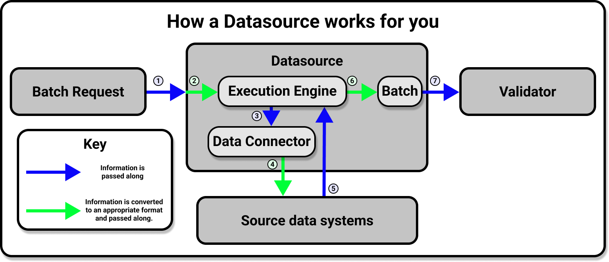

# [](./connect_to_data_overview.md) Connect to data: Overview 

import UniversalMap from '/docs/images/universal_map/_universal_map.mdx';
import Tabs from '@theme/Tabs';
import TabItem from '@theme/TabItem';
import TechnicalTag from '@site/docs/term_tags/_tag.mdx';

<!--Use 'inactive' or 'active' to indicate which Universal Map steps this term has a use case within.-->

<UniversalMap setup='inactive' connect='active' create='inactive' validate='inactive'/>

<!-- Only keep one of the 'To best understand this document' lines.  For processes like the Universal Map steps, use the first one.  For processes like the Architecture Reviews, use the second one. -->

Datasources and Data Assets provide an API for accessing and validating data on source data systems such as SQL-type data sources, local and remote file stores, and in-memory data frames.

## Prerequisites

- Completion of the [Quickstart guide](tutorials/quickstart/quickstart.md)

## Workflow

<!-- Brief outline of what the process entails.  -->

A <TechnicalTag tag="datasource" text="Datasource" /> provides a standard API for accessing and interacting with data from different source systems.


  
A Datasource provides an interface for an <TechnicalTag tag="execution_engine" text="Execution Engine" /> and possible external storage, and it allows Great Expectations to communicate with your source data systems.



To connect to data, you add a new Datasource to your <TechnicalTag tag="data_context" text="Data Context" /> according to the requirements of your underlying data system.  After you've configured your Datasource, you'll use the Datasource API to access and interact with your data, regardless of the original source systems that you use to store data.

<!-- The following subsections should be repeated as necessary.  They should give a high level map of the things that need to be done or optionally can be done in this process, preferably in the order that they should be addressed (assuming there is one). If the process crosses multiple steps of the Universal Map, use the <SetupHeader> <ConnectHeader> <CreateHeader> and <ValidateHeader> tags to indicate which Universal Map step the subsections fall under. -->

### Configure your Datasource

Your existing data systems determine how you connect to each Datasource type. To help you with your Datasource implementation, use one of the GX how-to guides for your specific use case and source data systems.

You configure a Datasource with Python and the GX Fluent Datasource API. A typical Datasource configuration appears similar to the following example:

```python name="tests/integration/docusaurus/connecting_to_your_data/connect_to_your_data_overview add_datasource"
```

The `name` key is a descriptive name for your Datasource. The `add_<datasource>` method takes the Datasource-specific arguments that are used to configure it. For example, the `add_pandas_filesystem` takes a `base_directory` argument in the previous example, while the `context.sources.add_postgres(name, ...)` method takes a `connection_string` that is used to connect to the database.

Call the `add_<datasource>` method in your context to run configuration checks. For example, it makes sure the `base_directory` exists for the `pandas_filesystem` Datasource and the `connection_string` is valid for a SQL database.

These methods also persist your Datasource to your source data systems. The source data systems depend on your <TechnicalTag tag="data_context" text="Data Context" />. For a File Data Context the changes are persisted to disk, for a Cloud Data Context the changes are persisted to the cloud, and for an Ephemeral Data Context the data remains in memory.

## View your Datasource configuration

The `context.datasources` attribute in your Data Context allows you to access your Datasource configuration. For example, the following command returns the Datasource configuration:

```python name="tests/integration/docusaurus/connecting_to_your_data/connect_to_your_data_overview config"
```
