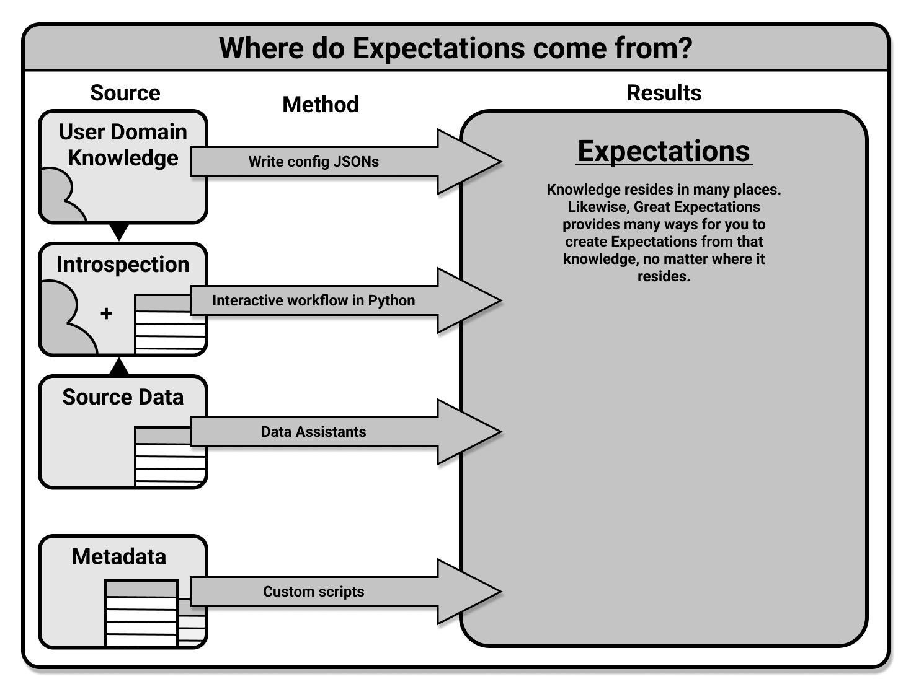

import UniversalMap from '/docs/images/universal_map/_universal_map.mdx';
import TechnicalTag from '@site/docs/term_tags/_tag.mdx';

<!--Use 'inactive' or 'active' to indicate which Universal Map steps this term has a use case within.-->

<UniversalMap setup='inactive' connect='inactive' create='active' validate='inactive'/>

## Prerequisites

- Completion of the [Quickstart guide](tutorials/quickstart/quickstart.md)

## Workflows

The following image shows the four workflows you can follow to create <TechnicalTag tag="expectation" text="Expectations" />:

The methodology for saving and testing Expectations is the same for all workflows. GX recommends using the interactive workflow or the Data Assistant workflow to create Expectations.

### Create Expectations interactively

In this workflow, you work in a Python interpreter or Jupyter Notebook.  You use a <TechnicalTag tag="validator" text="Validator" /> and call Expectations as methods on it to define them in an Expectation Suite, and when you have finished you save that Expectation Suite into your <TechnicalTag tag="expectation_store" text="Expectation Store" />. For an overview of this workflow, see [How to create and edit Expectations with instant feedback from a sample batch of data](./how_to_create_and_edit_expectations_with_instant_feedback_from_a_sample_batch_of_data.md).

### Create Expectations with Data Assistants

In this workflow, you use a <TechnicalTag tag="data_assistant" text="Data Assistant" /> to generate Expectations based on the input data you provide.  You can preview the Metrics that these Expectations are based on, and you can save the generated Expectations as an Expectation Suite in an Expectation Store. 

As with creating Expectations interactively, you start with your Data Context.  However, you work in a Python environment, so you need to load or create your Data Context as an instantiated object.  Next, you create a Batch Request to specify the data you would like to <TechnicalTag tag="profiling" text="Profile" /> with your Data Assistant.  Once you have a <TechnicalTag tag="batch_request" text="Batch Request" /> configured you will use it as the input for the run method of your Data Assistant, which can be accessed from your Data Context object.  Once the Data Assistant has run, you will be able to review the results and save the generated Expectations to an empty Expectation Suite.

GX recommends using the Onboarding Data Assistant to create an Expectation Suite. See [How to create an Expectation Suite with the Onboarding Data Assistant](./data_assistants/how_to_create_an_expectation_suite_with_the_onboarding_data_assistant.md). After you've created the Expectation Suite, it's expected that you'll edit and update the Expectation Suite to better suit your specific use case. The Expectation Suite is not intended to be used without changes.

### Manually define Expectations

Advanced users can use a manual process to create Expectations. This workflow does not require source data to work against, but it does require knowledge of the configurations available for Expectations. To create Expectations manually, see [how to create and edit expectations based on domain knowledge without inspecting data directly](./how_to_create_and_edit_expectations_based_on_domain_knowledge_without_inspecting_data_directly.md).

### Create Expectations with custom methods

Advanced users can use custom methods to generate Expectations that are based on source data system metadata. If you want to use custom methods to create Expectations, [contact a member of the support team on Slack](https://greatexpectations.io/slack).

### Test your Expectation Suite

After you've created and saved your Expectation Suite, GX recommends that you test it by Validating it. You can Validate an Expectation with `SimpleCheckpoint`.  An overview of the Validation process is provided [here](../validation/validate_data_overview.md).

### Edit a saved Expectation Suite

See [How to Edit an Expectation Suite](./how_to_edit_an_existing_expectationsuite.md)

## View Expectation Suite Expectations

See [View the Expectations in the Expectation Suite](./how_to_edit_an_existing_expectationsuite.md#4-view-the-expectations-in-the-expectation-suite).

## Next steps

- [Validate Data](../validation/validate_data_overview.md)

