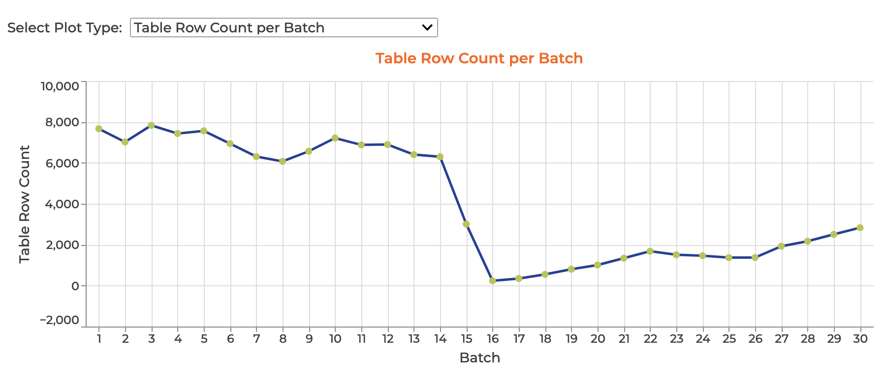

import Prerequisites from '../../../guides/connecting_to_your_data/components/prerequisites.jsx'
import TechnicalTag from '@site/docs/term_tags/_tag.mdx';

This guide demonstrates how to use the Onboarding Data Assistant to Profile your data and automate the generation of an
Expectation Suite, which you can then adjust to be suited for your specific needs.

## Prerequisites

<Prerequisites>

- A [configured Data Context](/docs/guides/setup/configuring_data_contexts/instantiating_data_contexts/how_to_quickly_instantiate_a_data_context).
- An understanding of how to [configure a Datasource](../../connecting_to_your_data/connect_to_data_overview.md).
- An understanding of how to [configure a Batch Request](/docs/0.15.50/guides/connecting_to_your_data/how_to_get_one_or_more_batches_of_data_from_a_configured_datasource).

</Prerequisites>

## Steps

### 1. Prepare your Batch Request

Data Assistants excel at automating the Profiling process across multiple Batches. Therefore, for this guide you will
 be using a Batch Request that covers multiple Batches. For the purposes of this demo, the Datasource that our Batch
 Request queries will consist of a sample of the New York taxi trip data.

This is the configuration that you will use for your `Datasource`:

```python name="tests/integration/docusaurus/expectations/data_assistants/how_to_create_an_expectation_suite_with_the_onboarding_data_assistant.py datasource_config"
```

And this is the configuration that you will use for your `BatchRequest`:

```python name="tests/integration/docusaurus/expectations/data_assistants/how_to_create_an_expectation_suite_with_the_onboarding_data_assistant.py batch_request"
```

:::caution
The Onboarding Data Assistant will run a high volume of queries against your `Datasource`. Data Assistant performance
  can vary significantly depending on the number of Batches, count of records per Batch, and network latency. It is
  recommended that you start with a smaller `BatchRequest` if you find that Data Assistant runtimes are too long.
:::

### 2. Prepare a new Expectation Suite

Preparing a new Expectation Suite is done with the Data Context's `add_expectation_suite(...)` method, as seen in
this code example:

```python name="tests/integration/docusaurus/expectations/data_assistants/how_to_create_an_expectation_suite_with_the_onboarding_data_assistant.py expectation_suite"
```

### 3. Run the Onboarding Data Assistant

Running a Data Assistant is as simple as calling the `run(...)` method for the appropriate assistant.

That said, there are numerous parameters available for the `run(...)` method of the Onboarding Data Assistant. For
 instance, the `exclude_column_names` parameter allows you to provide a list columns that should not be Profiled.

For this guide, you will exclude the following columns:

```python name="tests/integration/docusaurus/expectations/data_assistants/how_to_create_an_expectation_suite_with_the_onboarding_data_assistant.py exclude_column_names"
```

The following code shows how to run the Onboarding Assistant. In this code block, `context` is an instance of your Data Context.
```python name="tests/integration/docusaurus/expectations/data_assistants/how_to_create_an_expectation_suite_with_the_onboarding_data_assistant.py data_assistant_result"
```

:::note
If you consider your `BatchRequest` data valid, and want to produce Expectations with ranges that are identical to the
  data in the `BatchRequest`, there is no need to alter the command above. You will be using the default `estimation` parameter (`"exact"`).
  If you want to identify potential outliers in your `BatchRequest` data, pass `estimation="flag_outliers"` to the `run(...)` method.
:::

:::note
The Onboarding Data Assistant `run(...)` method can accept other parameters in addition to `exclude_column_names` such
  as `include_column_names`, `include_column_name_suffixes`, and `cardinality_limit_mode`.
  For a description of the available parameters please see this docstring [here](https://github.com/great-expectations/great_expectations/blob/develop/great_expectations/rule_based_profiler/data_assistant/onboarding_data_assistant.py#L44).
:::

:::note
If you would like to learn how to edit the Expectation Suite, please refer to [How to Guide on How to Edit an Expectation Suite](../../expectations/how_to_edit_an_existing_expectationsuite.md)
:::

### 4. Save your Expectation Suite

Once you have executed the Onboarding Data Assistant's `run(...)` method and generated Expectations for your data, you
 need to load them into your Expectation Suite and save them. You will do this by using the Data Assistant result:

```python name="tests/integration/docusaurus/expectations/data_assistants/how_to_create_an_expectation_suite_with_the_onboarding_data_assistant.py get_expectation_suite"
```

And once the Expectation Suite has been retrieved from the Data Assistant result, you can save it like so:

```python name="tests/integration/docusaurus/expectations/data_assistants/how_to_create_an_expectation_suite_with_the_onboarding_data_assistant.py save_expectation_suite"
```

### 5. Test your Expectation Suite with a `SimpleCheckpoint`

To verify that your Expectation Suite is working, you can use a `SimpleCheckpoint`. First, you will configure one to
 operate with the Expectation Suite and Batch Request that you have already defined:

```python name="tests/integration/docusaurus/expectations/data_assistants/how_to_create_an_expectation_suite_with_the_onboarding_data_assistant.py checkpoint_config"
```

Once you have our `SimpleCheckpoint`'s configuration defined, you can instantiate a `SimpleCheckpoint` and run it. You
 can check the `"success"` key of the `SimpleCheckpoint`'s results to verify that your Expectation Suite worked.

```python name="tests/integration/docusaurus/expectations/data_assistants/how_to_create_an_expectation_suite_with_the_onboarding_data_assistant.py checkpoint"
```

### 6. Plot and inspect the Data Assistant's calculated Metrics and produced Expectations

To see Batch-level visualizations of Metrics computed by the Onboarding Data Assistant run:

```python name="tests/integration/docusaurus/expectations/data_assistants/how_to_create_an_expectation_suite_with_the_onboarding_data_assistant.py plot_metrics"
```



:::note
Hovering over a data point will provide more information about the Batch and its calculated Metric value in a tooltip.
:::

To see all Metrics computed by the Onboarding Data Assistant run:

```python name="tests/integration/docusaurus/expectations/data_assistants/how_to_create_an_expectation_suite_with_the_onboarding_data_assistant.py metrics_by_domain"
```

To plot the Expectations produced, and the associated Metrics calculated by the Onboarding Data Assistant run:

```python name="tests/integration/docusaurus/expectations/data_assistants/how_to_create_an_expectation_suite_with_the_onboarding_data_assistant.py plot_expectations_and_metrics"
```


:::note
If no Expectation was produced by the Data Assistant for a given Metric, neither the Expectation nor the Metric will be visualized by the `plot_expectations_and_metrics()` method.
:::

To see the Expectations produced and grouped by Domain run:

```python name="tests/integration/docusaurus/expectations/data_assistants/how_to_create_an_expectation_suite_with_the_onboarding_data_assistant.py show_expectations_by_domain_type"
```

To see the Expectations produced and grouped by Expectation type run:

```python name="tests/integration/docusaurus/expectations/data_assistants/how_to_create_an_expectation_suite_with_the_onboarding_data_assistant.py show_expectations_by_expectation_type"
```

### 7. (Optional) Edit your Expectation Suite, save, and test again.

The Onboarding Data Assistant will create as many applicable Expectations as it can for the permitted columns. This
 provides a solid base for analyzing your data, but may exceed your needs. It is also possible that you may possess
 some domain knowledge that is not reflected in the data that was sampled for the Profiling process. In either of these
 (or any other) cases, you can edit your Expectation Suite to more closely suite your needs.

To edit an existing Expectation Suite (such as the one that you just created and saved with the Onboarding Data
 Assistant) you need only execute the following console command:

```markdown title="Terminal command"
great_expectations suite edit NAME_OF_YOUR_SUITE_HERE
```

This will open a Jupyter Notebook that will permit you to review, edit, and save changes to the specified Expectation
 Suite.

## Additional Information

:::note Example Code

To view the full script used for example code on this page, see it on GitHub:
- [how_to_create_an_expectation_suite_with_the_onboarding_data_assistant.py](https://github.com/great-expectations/great_expectations/blob/develop/tests/integration/docusaurus/expectations/data_assistants/how_to_create_an_expectation_suite_with_the_onboarding_data_assistant.py)

:::
