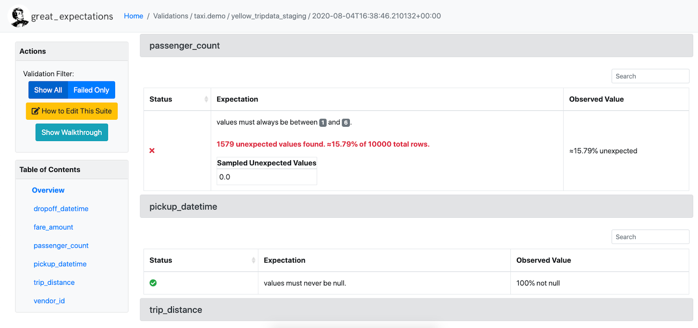

Great Expectations is the leading tool for [validating](./terms/validation.md) and [documenting](./terms/data_docs.md) your data. If you're ready to get started, see the [Quickstart](tutorials/quickstart/quickstart.md).

Software developers have long known that automated testing is essential for managing complex codebases. Great Expectations brings the same discipline, confidence, and acceleration to data science and data engineering teams.


### Why use Great Expectations?

With Great Expectations, you can assert what you expect from the data you load and transform, and catch data issues quickly – Expectations are basically unit tests for your data. Not only that, but Great Expectations also creates data documentation and data quality reports from those Expectations. Data science and data engineering teams use Great Expectations to:

- Test data they ingest from other teams or vendors and ensure its validity.
- Validate data they transform as a step in their data pipeline in order to ensure the correctness of transformations.
- Prevent data quality issues from slipping into data products.
- Streamline knowledge capture from subject-matter experts and make implicit knowledge explicit.
- Develop rich, shared documentation of their data.

To learn more about how data teams are using Great Expectations, see [Case studies from Great Expectations](https://greatexpectations.io/case-studies/).

### Key Features
#### Expectations

Expectations are assertions about your data. In Great Expectations, those assertions are expressed in a declarative language in the form of simple, human-readable Python methods. For example, in order to assert that you want the column “passenger_count” to be between 1 and 6, you can say:

```python
expect_column_values_to_be_between(
    column="passenger_count",
    min_value=1,
    max_value=6
)
```

Great Expectations then uses this statement to validate whether the column passenger_count in a given table is indeed between 1 and 6, and returns a success or failure result. The library currently provides several dozen highly expressive built-in Expectations, and allows you to write custom Expectations.

#### Data validation

Once you’ve created your Expectations, Great Expectations can load any batch or several batches of data to validate with your suite of Expectations. Great Expectations tells you whether each Expectation in an Expectation Suite passes or fails, and returns any unexpected values that failed a test, which can significantly speed up debugging data issues!

#### Data Docs

Great Expectations renders Expectations in a clean, human-readable format called Data Docs. These HTML docs contain both your Expectation Suites and your data Validation Results each time validation is run – think of it as a continuously updated data quality report. The following image shows a sample Data Doc:



#### Support for various Datasources and Store backends

Great Expectations currently supports native execution of Expectations against various Datasources, such as Pandas dataframes, Spark dataframes, and SQL databases via SQLAlchemy. This means you’re not tied to having your data in a database in order to validate it: You can also run Great Expectations against CSV files or any piece of data you can load into a dataframe.

Great Expectations is highly configurable. It allows you to store all relevant metadata, such as the Expectations and Validation Results in file systems, database backends, as well as cloud storage such as S3 and Google Cloud Storage, by configuring metadata Stores.

### What does Great Expectations NOT do?

Great Expectations is NOT a pipeline execution framework.

Great Expectations integrates seamlessly with DAG execution tools such as [Airflow](https://airflow.apache.org/), [dbt](https://www.getdbt.com/), [Prefect](https://www.prefect.io/), [Dagster](https://github.com/dagster-io/dagster), and [Kedro](https://github.com/quantumblacklabs/kedro). Great Expectations does not execute your pipelines for you, but instead, validation can simply be run as a step in your pipeline.

Great Expectations is NOT a data versioning tool.

Great Expectations does not store data itself. Instead, it deals in metadata about data: Expectations, Validation Results, etc. If you want to bring your data itself under version control, check out tools like: [DVC](https://dvc.org/), [Quilt](https://github.com/quiltdata/quilt), and [lakeFS](https://github.com/treeverse/lakeFS/).

Great Expectations currently works best in a Python environment.

Great Expectations is Python-based. You can invoke it from the command line without using a Python programming environment, but if you’re working in another ecosystem, other tools might be a better choice. If you’re running in a pure R environment, you might consider [assertR](https://github.com/ropensci/assertr)  as an alternative. Within the TensorFlow ecosystem, [TFDV](https://www.tensorflow.org/tfx/guide/tfdv) fulfills a similar function as Great Expectations.

### Community Resources

Great Expectations is committed to supporting and the growing Great Expectations community. It’s not enough to build a great tool. Great Expectations wants to build a great community as well.

Open source doesn’t always have the best reputation for being friendly and welcoming, and that makes us sad. Everyone belongs in open source, and Great Expectations is dedicated to making you feel welcome.

#### Contact Great Expectations
Join the Great Expectations [public Slack channel](https://greatexpectations.io/slack). Before you post for the first time, review the [Slack Guidelines](https://discourse.greatexpectations.io/t/slack-guidelines/1195).

#### Ask a question
Slack is good for that, too: [join Slack](https://greatexpectations.io/slack) and read [How to write a good question in Slack](https://github.com/great-expectations/great_expectations/discussions/4951). You can also use [GitHub Discussions](https://github.com/great-expectations/great_expectations/discussions/4951).

#### File a bug report or feature request
If you have bugfix or feature request, see [upvote an existing issue](https://github.com/great-expectations/great_expectations/issues) or [open a new issue](https://github.com/great-expectations/great_expectations/issues/new).

#### Contribute code or documentation
To make a contribution to Great Expectations, see [Contribute](./contributing/contributing_overview.md).

#### Not interested in managing your own configuration or infrastructure? 
Learn more about Great Expectations Cloud, a fully managed SaaS offering. Sign up for [the weekly cloud workshop](https://greatexpectations.io/cloud)! You’ll get to preview the latest features and participate in the private Alpha program!
