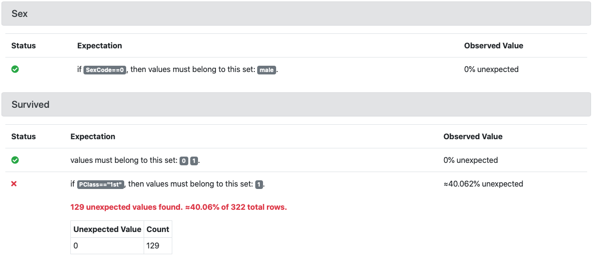

import CLIRemoval from '/docs/components/warnings/_cli_removal.md'


Sometimes one may hold an Expectation not for a dataset in its entirety but only for a particular subset. Alternatively,
what one expects of some variable may depend on the value of another. One may, for example, expect a column that holds
the country of origin to not be null only for people of foreign descent.

Great Expectations allows you to express such Conditional Expectations via a `row_condition` argument that can be passed
to all Dataset Expectations.

Today, conditional Expectations are available for the Pandas, Spark, and SQLAlchemy backends. The
feature is **experimental**. Please expect changes to API as additional backends are supported.

When using conditional Expectations the `row_condition` argument should be a boolean expression string.

Additionally, the `condition_parser` argument must be provided, which defines the syntax of conditions. When implementing conditional Expectations with Pandas, 
this argument must be set to `"pandas"`. When implementing conditional Expectations with Spark or SQLAlchemy, this argument must be set to `"great_expectations__experimental__"`. 
As support for conditional Expectations matures, available `condition_parser` arguments may change.

:::note
In Pandas the `row_condition` value will be passed to `pandas.DataFrame.query()` before Expectation Validation (see
the [Pandas docs](https://pandas.pydata.org/pandas-docs/stable/reference/api/pandas.DataFrame.query.html).

In Spark & SQLAlchemy, the `row_condition` value will be parsed as a filter or query to your data before Expectation Validation.
:::

The feature can be used, e.g., to test if different encodings of identical pieces of information are consistent with
each other. See the following example setup:

```python
validator.expect_column_values_to_be_in_set(
    column='Sex',
    value_set=['male'],
    condition_parser='pandas',
    row_condition='SexCode==0'
)
```

This will return:

```python
{
    "success": true,
    "result": {
        "element_count": 851,
        "missing_count": 0,
        "missing_percent": 0.0,
        "unexpected_count": 0,
        "unexpected_percent": 0.0,
        "unexpected_percent_nonmissing": 0.0,
        "partial_unexpected_list": []
    }
}
```

:::note
For instructions on how to get a Validator object, please see [our guide on how to create and edit Expectations with instant feedback from a sample Batch of data](../../guides/expectations/how_to_create_and_edit_expectations_with_instant_feedback_from_a_sample_batch_of_data.md).
:::

It is also possible to add multiple Expectations of the same type to the Expectation Suite for a single column. At most
one Expectation can be unconditional while an arbitrary number of Expectations -- each with a different condition -- can
be conditional.

```python
validator.expect_column_values_to_be_in_set(
        column='Survived',
        value_set=[0, 1]
    )
validator.expect_column_values_to_be_in_set(
        column='Survived',
        value_set=[1],
        condition_parser='pandas',
        row_condition='PClass=="1st"'
    )
# The second Expectation fails, but we want to include it in the output:
validator.get_expectation_suite(
  discard_failed_expectations=False
)  
```

This results in the following Expectation Suite:
```python
{
    "expectation_suite_name": "default",
    "expectations": [
        {
            "meta": {},
            "kwargs": {
                "column": "Survived",
                "value_set": [0, 1]
            },
            "expectation_type": "expect_column_values_to_be_in_set"
        },
        {
            "meta": {},
            "kwargs": {
                "column": "Survived",
                "value_set": [1],
                "row_condition": "PClass==\"1st\"",
                "condition_parser": "pandas"
            },
            "expectation_type": "expect_column_values_to_be_in_set"
        }
    ],
    "data_asset_type": "Dataset"
}
```

:::note
In the earlier rendition of conditional Expectations, the `row_condition` parameter would be overridden by `filter_nan` and `filter_none`.  This prevented `row_conditions` from being defined when `filter_nan` and `filter_none` were being used and was handled by raising an Error.  This conflict has been resolved since then and now all three parameters can be used together without causing an error to be thrown.
:::

### Gotchas for formatting of `row_conditions` values


You should not use single quotes nor `\n` inside the specified `row_condition` (see examples below).

```python 
row_condition="PClass=='1st'"  # never use simple quotes inside !!!
```

```python 
row_condition="""
PClass=="1st"
"""  # never use \n inside !!!
```

:::warning
If you do use single quotes or `\n` inside a specified `row_condition` a bug may be introduced when running `great_expectations suite edit` from the CLI.
:::

## Data Docs and Conditional Expectations

Conditional Expectations are displayed differently from standard Expectations in the Data Docs. Each Conditional
Expectation is qualified with *if 'row_condition_string', then values must be...*



If *'row_condition_string'* is a complex expression, it will be split into several components for better readability.

## Scope and limitations

While conditions can be attached to most Expectations, the following Expectations cannot be conditioned by their very
nature and therefore do not take the `row_condition` argument:

* ```expect_column_to_exist```
* ```expect_table_columns_to_match_ordered_list```
* ```expect_table_column_count_to_be_between```
* ```expect_table_column_count_to_equal```

For more information, see the [Data Docs](../../terms/data_docs.md) feature guide.
