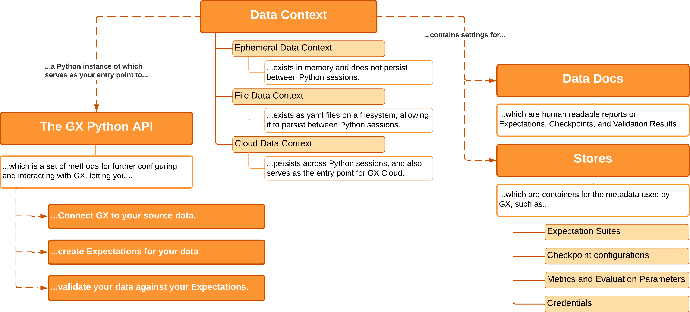
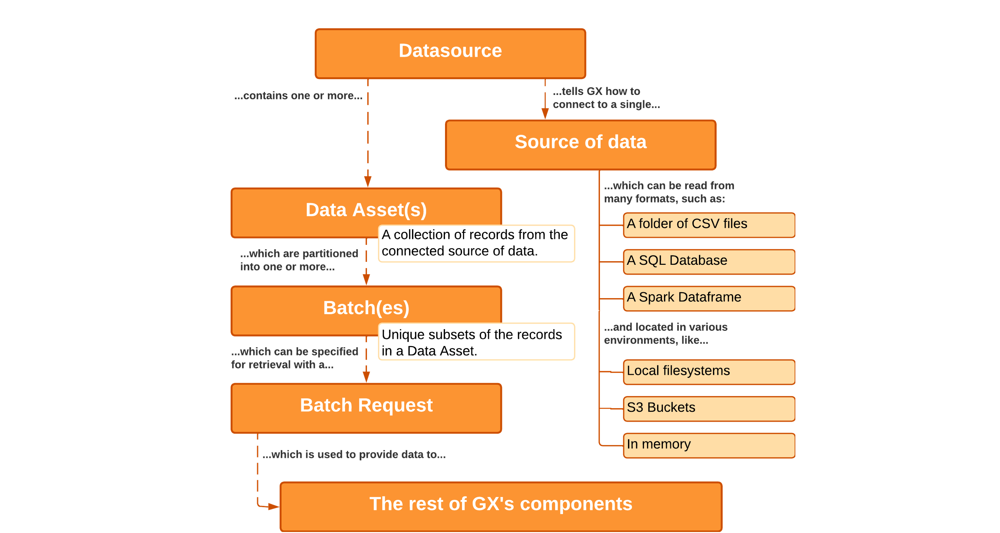
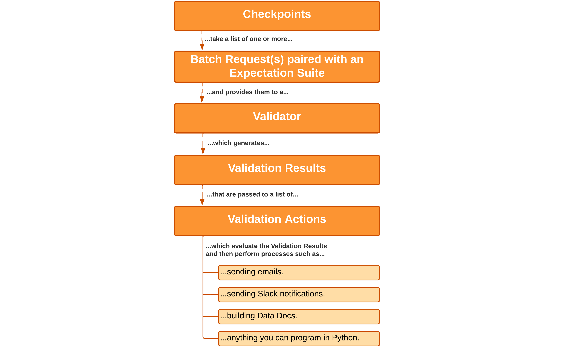

import CheckpointFlowchart from './images_overview/checkpoint_flowchart.png'

The information provided here is intended for new users of Great Expectations (GX) and those looking for an understanding of its components and its primary workflows. This overview of GX doesn’t require an in-depth understanding of the code that governs GX processes and interactions. This is an ideal place to start before moving to more advanced topics, or if you want a better understanding of GX functionality.

## What is GX

GX is a Python library that provides a framework for describing the acceptable state of data and then validating that the data meets those criteria.

## GX core components

When working with GX you use the following four core components to access, store, and manage underlying objects and processes:

- **[Data Context:](#data-context)** Manages the settings and metadata for a GX project, and provides an entry point to the GX Python API.
- **[Data Sources:](#datasources)** Connects to your Data Source, and organizes retrieved data for future use.
- **[Expectations:](#expectations)** Identifies the standards to which your data should conform.
- **[Checkpoints:](#checkpoints)** Validates a set of Expectations against a specific set of data.

## Data Context

A Data Context manages the settings and metadata for a GX project.  In Python, the Data Context object serves as the entry point for the GX API and manages various classes to limit the objects you need to directly manage yourself.  A Data Context contains all the metadata used by GX, the configurations for GX objects, and the output from validating data.

The following are the available Data Context types:
- **Ephemeral Data Context:** Exists in memory, and does not persist beyond the current Python session.
- **File Data Context:** Exists as a folder and configuration files. Its contents persist between Python sessions.
- **Cloud Data Context:** Supports persistence between Python sessions, but additionally serves as the entry point for Great Expectations Cloud.

For more information, see [Configure Data Contexts](/oss/guides/setup/configure_data_contexts_lp.md).

### The GX API

A Data Context object in Python provides methods for configuring and interacting with GX.  These methods and the objects and additional methods accessed through them compose the GX public API.

For more information, see [The GX API reference](/reference/api_reference.md).

### Stores

Stores contain the metadata GX uses.  This includes configurations for GX objects, information that is recorded when GX validates data, and credentials used for accessing data sources or remote environments.  GX utilizes one Store for each type of metadata, and the Data Context contains the settings that tell GX where that Store should reside and how to access it.

For more information, see [Configure your GX environment](/oss/guides/setup/setup_overview_lp.md).

### Data Docs

Data Docs are human-readable documentation generated by GX.  Data Docs describe the standards that you expect your data to conform to, and the results of validating your data against those standards.  The Data Context manages the storage and retrieval of this information.

You can configure where your Data Docs are hosted.  Unlike Stores, you can define configurations for multiple Data Docs sites.  You can also specify what information each Data Doc site provides, allowing you to format and provide different Data Docs for different use cases.

For more information, see [Host and share Data Docs](/oss/guides/setup/configuring_data_docs/host_and_share_data_docs.md).

## Data Sources

Data Sources connect GX to Data Assets such as CSV files in a folder, a PostgreSQL database hosted on AWS, or any combination of data formats and environments. Regardless of the format of your Data Asset or where it resides, Data Sources provide GX with a unified API for working with it.

For more information, see [Connect to data](/oss/guides/connecting_to_your_data/connect_to_data_lp.md).

### Data Assets and Batches

Data Assets are collections of records within a Data Source.  A Data Source tells GX how to connect to your Data Assets and Data Assets tell GX how to organize that data. Although the records in your Data Assets can correspond directly to the contents of tables or files in your Data Source they do not necessarily need to. For instance, you could combine multiple tables worth of records in a SQL Data Source into a single Query Data Asset that joins the tables in question.  For a File Data Source, you could use regular expressions to define a Data Asset as the contents of all the `.csv` files in a specific subfolder.

Data Assets can be further partitioned into Batches.  Batches are unique subsets of records within a Data Asset.  For example, say you have a Data Asset in a SQL Data Source that consists of all records from last year in a given table.  You could then partition those records into Batches of data that correspond to the records for individual months of that year.

For more information, see [Manage Data Assets](/oss/guides/connecting_to_your_data/manage_data_assets_lp.md).

### Batch Requests

A Batch Request specifies one or more Batches within the Data Asset.  Batch Requests are the primary way of retrieving data for use in GX.  Because Batch Requests can retrieve multiple Batches they provide significant flexibility in how you utilize the data in a single Data Asset.

As an example, GX can automate the process of running statistical analyses for multiple Batches of data.  This is possible because you can provide a Batch Request that corresponds to multiple Batches in a Data Asset.  Alternatively, you can specify a single Batch from that same Data Asset so that you do not need to re-run the analyses on all of your data when you are only interested in a single subset.

Taking the example of a Data Asset that has been partitioned into Batches by months, this would let you build a statistical model off of each month of your existing data by providing all of the Batches in a single Batch Request.  Then, after an update, you could specify that you only wanted to run your analysis on the most recent month's data by providing a Batch Request that only indicates that one Batch.

For more information, see [Request data from a Data Asset](/oss/guides/connecting_to_your_data/fluent/batch_requests/how_to_request_data_from_a_data_asset.md).

## Expectations

An Expectation is a verifiable assertion about data.  Similar to assertions in traditional Python unit tests, Expectations provide a flexible, declarative language for describing expected behaviors. Unlike traditional unit tests which describe the expected behavior of code given a specific input, Expectations apply to the input data itself. For example, you can define an Expectation that a column contains no null values. When GX runs that Expectation on your data it generates a report which indicates if a null value was found.

Expectations can be built directly from the domain knowledge of subject matter experts, interactively while introspecting a set of data, or through automated tools provided by GX.

For a list of available Expectations, see [the Expectation Gallery](https://greatexpectations.io/expectations/).

For more information, see [Create Expectations](/oss/guides/expectations/expectations_lp.md).

### Expectation Suites

Expectation Suites are collections of Expectations describing your data.  When GX validates data, an Expectation Suite helps streamline the process by running all of the contained Expectations against that data.  In almost all cases, when you create an Expectation you will be creating it inside of an Expectation Suite object.

You can define multiple Expectation Suites for the same data to cover different use cases.  An example could be having one Expectation Suite for raw data, and a more strict Expectation Suite for that same data post-processing.  Because an Expectation Suite is decoupled from a specific source of data, you can apply the same Expectation Suite against multiple, disparate Data Sources.  For instance, you can reuse an Expectation Suite that was created around an older set of data to validate the quality of a new set of data.

For more information, see [Create and manage Expectations and Expectation Suites](/oss/guides/expectations/create_manage_expectations_lp.md).

### Data Assistants

A Data Assistant is a utility that automates the process of building Expectations by asking questions about your data, gathering information to describe what is observed, and then presenting Metrics and proposed Expectations based on the answers it has determined.  This can accelerate the process of creating Expectations for the provided data.

For more information, see [Data Assistants](/oss/guides/expectations/data_assistants_lp.md).

### Custom Expectations

A built-in library of more than 50 common expectations is included with GX.  However, you can also create custom Expectations if you need a more specialized one for your data validation.  You can also use custom Expectations that have been contributed by other GX community members by installing them as Plugins.

For more information, see:
- [Create Custom Expectations](/oss/guides/expectations/custom_expectations_lp.md)
- [Use a Custom Expectation](/oss/guides/expectations/creating_custom_expectations/how_to_use_custom_expectations.md)

## Checkpoints

A Checkpoint is the primary means for validating data in a production deployment of GX. Checkpoints provide an abstraction for bundling a Batch (or Batches) of data with an Expectation Suite (or several), and then running those Expectations against the paired data.

For more information, see [Validate Data](/oss/guides/validation/checkpoints/checkpoint_lp.md).

### Validation Results

The Validation Results returned by GX tell you how your data corresponds to what you expected of it. You can view this information in the Data Docs that are configured in your Data Context. Evaluating your Validation Results helps you identify issues with your data. If the Validation Results show that your data meets your Expectations, you can confidently use it.

For more information, see [Validation Result](/reference/learn/terms/validation_result.md).

### Actions

One of the most powerful features of Checkpoints is that you can configure them to run Actions. The Validation Results generated when a Checkpoint runs determine what Actions are performed. Typical use cases include sending email, Slack messages, or custom notifications. Another common use case is updating Data Docs sites. Actions can be used to do anything you are capable of programming in Python. Actions are a versatile tool for integrating Checkpoints in your pipeline's workflow.

For more information, see [Configure Actions](/oss/guides/validation/validation_actions/actions_lp.md).