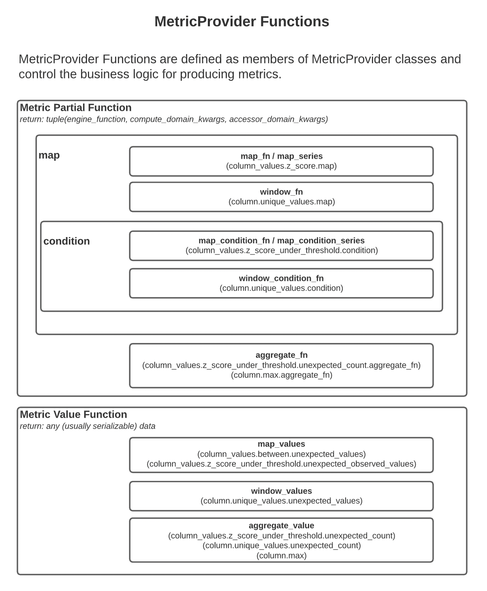

Metrics are values derived from one or more Batches that can be used to evaluate Expectations or to summarize the result
of Validation. A Metric could be a statistic, such as the minimum value of the column, or a more complex object, such as
a histogram. 

Metrics are the core tool used to validate data. When an Expectation should be evaluated, Great Expectations collects
all the Metrics requested by the Expectation and provides them to the Expectation's validation logic. The Expectation
can also expose Metrics, such as the observed value of a useful statistic via an Expectation Validation Result, where
Data Docs -- or other Expectations -- can use them.

Put simply, a Metric answers a question about your data posed by an [**Expectation**](expectations/expectations.md).

Metrics are produced using ExecutionEngine-specific logic that is defined in a `MetricProvider`. When a MetricProvider
class is first encountered, Great Expectations will register the metric and any methods that it defines as able to
produce Metrics.

## Metrics naming conventions

Metrics can have any name. However, for the "core" Great Expectations Metrics, we use the following conventions:

* For **aggregate metrics**, such as the mean value of a column, we use describe the domain and name of the statistic,
  such as `column.mean` or `column.max`.
* For **map metrics**, which produce values for individual records or rows, we define the domain using the prefix "
  column_values" and use several consistent suffixes to provide related metrics. For example, for the Metric that
  defines whether specific column values fall into an expected set, several related metrics are defined:
    * `column_values.in_set.unexpected_count` provides the total number of unexpected values in the domain.
    * `column_values.in_set.unexpected_values` provides a sample of unexpected_values; "result_format" is one of its
      value_keys to determine how many values should be returned.
    * `column_values.in_set.unexpected_rows` provides full rows for which the value in the domain column was unexpected
    * `column_values.in_set.unexpected_value_counts` provides a count of how many times each unexpected value occurred

Additionally, to facilitate optimized computation of Metrics, we use **Metric Partials** which define
partially-parameterized functions that are necessary to build a desired Metric.

* For aggregate metrics, we often use an ExecutionEngine specific function with the suffix `.aggregate_fn`, such
  as `column.max.aggregate_fn`.
* For map metrics, to compute `column_values.in_set.unexpected_count`, we will rely on a **condition**
  called `column_values.in_set.condition`.

## Types of MetricProvider Functions

This diagram shows the relationship between different types of MetricProvider functions.



## Accessing Metrics

Expectation Validation Results and Expectation Suite Validation Results can expose metrics that are defined by specific
Expectations that have been validated, called "Expectation Defined Metrics." To access those values, we address the
metric as a dot-delimited string that identifies the value, such as `expect_column_values_to_be_unique .success`
or `expect_column_values_to_be_between.result.unexpected_percent`. These metrics may be stored in a MetricsStore.

It is important to note that these metrics are *NOT* available for compute on raw data directly as other metrics are.

A `metric_kwargs_id` is a string representation of the Metric Kwargs that can be used as a database key. For simple
cases, it could be easily readable, such as `column=Age`, but when there are multiple keys and values or complex values,
it will most likely be an md5 hash of key/value pairs. It can also be `None` in the case that there are no kwargs
required to identify the metric.

The following examples demonstrate how metrics are defined:

```python
res = df.expect_column_values_to_be_in_set(
    "color",
    ["red", "green"]
)
res.get_metric(
    "expect_column_values_to_be_in_set.result.missing_count",
    column="color"
)
```

See the [How to configure a MetricsStore](../guides/setup/configuring_metadata_stores/how_to_configure_a_metricsstore.md) guide for more information.
