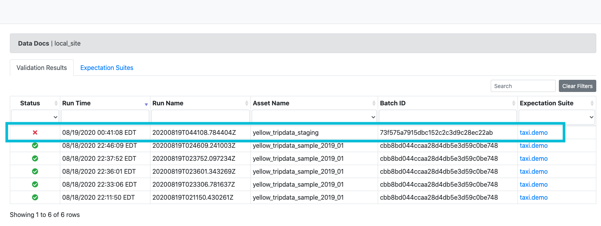
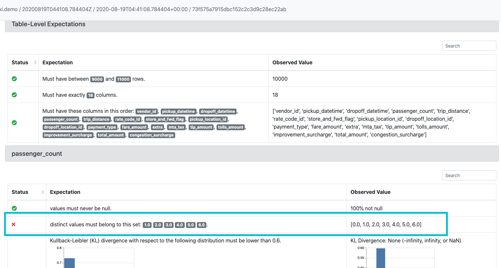

[Validation](...) is the core operation of Great Expectations: “Validate data X against Expectation Y.”

In normal usage, the best way to validate data is with a [Checkpoint](...). Checkpoints bundle [Batches](...) of data with corresponding [Expectation Suites](...) for validation.

Let’s set up our first Checkpoint! **Go back to your terminal** and shut down the Jupyter notebook, if you haven’t yet. Then run the following command:

````console
great_expectations --v3-api checkpoint new staging.chk taxi.demo
````

From there, you will be prompted by the CLI to configure the Checkpoint:

````console
Which table would you like to use? (Choose one)
    1. yellow_tripdata_sample_2019_01 (table)
    2. yellow_tripdata_staging (table)
    Do not see the table in the list above? Just type the SQL query
2

A checkpoint named `staging.chk` was added to your project!
...
````

**What just happened?**

* ```staging.chk``` is the name of your new Checkpoint.

* The Checkpoint uses ```taxi.demo``` as its primary Expectation Suite.

* You configured the Checkpoint to validate the ```yellow_tripdata_staging``` table.

That way, **we can simply run the Checkpoint each time we have new data loaded** to ```yellow_tripdata_staging``` and validate that the data meets our Expectations!

# How to validate data by running Checkpoints

The final step in this tutorial is to use our Expectation Suite to alert us of the 0 values in the ```passenger_count``` column in the staging data! Run the Checkpoint we just created to trigger validation of the staging data:

````console
great_expectations checkpoint run staging.chk
````

This will output the following:

````console
Validation failed!
````

What just happened?

We ran the Checkpoint and it **successfully failed!** Yes, that’s correct, and that’s we wanted. We know that in this example, the staging data has data quality issues, which means we expect the validation to fail. Let’s open up Data Docs again to see the details.

If you navigate to the Data Docs Home page and refresh, you will now see a failed validation run at the top of the page:



If you click through to the validation results page, you will see that the validation of the staging data failed because the set of Observed Values in the passenger_count column contained the value 0.0! This violates our Expectation, which makes the validation fail.



**And this is it!**

We have successfully created an Expectation Suite based on historical data, and used it to detect an issue with our new data.

Wrap-up and next steps
In this tutorial, we have covered the following basic capabilities of Great Expectations:

* Setting up a Data Context

* Connecting a Data Source

* Exploring validation results in Data Docs

* Validating a new batch of data with a Checkpoint

As a final, **optional step**, you can check out the next section on how to customize your deployment in order to configure options such as where to store Expectations, validation results, and Data Docs.

And if you want to stop here, feel free to join our Slack community to say hi to fellow Great Expectations users in the **[#beginners](https://greatexpectations.io/slack)** channel!
