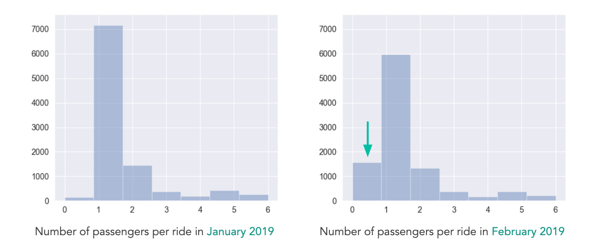

:::note Prerequisites
- You need a Python environment where you can install Great Expectations and other dependencies, e.g. a virtual environment.
:::

### About the example data

The [NYC taxi data](https://www1.nyc.gov/site/tlc/about/tlc-trip-record-data.page) we’re going to use in this tutorial is an open data set which is updated every month. Each record in the data corresponds to one taxi ride and contains information such as the pick up and drop-off location, the payment amount, and the number of passengers, among others.

In this tutorial, we provide two CSV files, each with a 10,000 row sample of the Yellow Taxi Trip Records set:

- **yellow_tripdata_sample_2019-01.csv**: a sample of the January 2019 taxi data

- **yellow_tripdata_sample_2019-02.csv**: a sample of the February 2019 taxi data

If we compare the `passenger_count` column in the January and February data, we find a significant difference: The February data contains a large proportion of rides with 0 passengers, which seems unexpected:



:::note The data problem we're solving in this tutorial:

In this tutorial, we will be creating an Expectation Suite for this example data set that allows us to assert that we expect **at least 1 passenger per taxi ride** based on what we see in the January 2019 data (and based on what we expect about taxi rides!). We will then use that Expectation Suite to catch data quality issues in the February data set.

:::

### Set up your machine for the tutorial
For this tutorial, we will use a simplified version of the NYC taxi ride data.

Clone the [ge_tutorials](https://github.com/superconductive/ge_tutorials) repository to download the data and directories with the final versions of the tutorial, which you can use for reference:

```console
git clone https://github.com/superconductive/ge_tutorials
cd ge_tutorials
```

### What you find in the `ge_tutorials` repository

The repository you cloned contains several directories with final versions for our tutorials. The final version for this tutorial is located in the `getting_started_tutorial_final_v3_api/` folder. You can use the final version as a reference or to explore a complete deploy of Great Expectations, but **you do not need it for this tutorial**.

### Install Great Expectations and dependencies

If you haven’t already, install Great Expectations. This tutorial will be easiest if you [install Great Expectations locally](/docs/guides/setup/installation/local), but there are also guides on how to [install Great Expectations in Spark EMR Cluster](/docs/guides/setup/installation/spark_emr) and how to [install Great Expectations in Databricks](/docs/guides/setup/installation/databricks).

### Create a Data Context

In Great Expectations, your Data Context manages your project configuration, so let’s go and create a Data Context for our tutorial project!

When you installed Great Expectations, you also installed the Great Expectations command line interface (CLI). It provides helpful utilities for deploying and configuring Data Contexts, plus a few other convenience methods. Note that since we’re using the V3 (Batch Request) API in this tutorial, all CLI commands will use the `--v3-api` flag.

To initialize your Great Expectations deployment for the project, run this command in the terminal from the `ge_tutorials/` directory:

```console
great_expectations --v3-api init
```
You should see this:
```console
Using v3 (Batch Request) API

  ___              _     ___                  _        _   _
 / __|_ _ ___ __ _| |_  | __|_ ___ __  ___ __| |_ __ _| |_(_)___ _ _  ___
| (_ | '_/ -_) _` |  _| | _|\ \ / '_ \/ -_) _|  _/ _` |  _| / _ \ ' \(_-<
 \___|_| \___\__,_|\__| |___/_\_\ .__/\___\__|\__\__,_|\__|_\___/_||_/__/
                                |_|
             ~ Always know what to expect from your data ~

Let's configure a new Data Context.

First, Great Expectations will create a new directory:

    great_expectations
    |-- great_expectations.yml
    |-- expectations
    |-- checkpoints
    |-- notebooks
    |-- plugins
    |-- .gitignore
    |-- uncommitted
        |-- config_variables.yml
        |-- documentation
        |-- validations

OK to proceed? [Y/n]: <press Enter>
```

#### The ```great_expectations/``` directory structure

After running the ```init``` command, your ```great_expectations/``` directory will contain all of the important components of a local Great Expectations deployment. This is what the directory structure looks like:

* ```great_expectations.yml``` contains the main configuration of your deployment.
* The ```expectations/``` directory stores all your Expectations as JSON files. If you want to store them somewhere else, you can change that later.
* The ```notebooks/``` directory is for helper notebooks to interact with Great Expectations.
* The ```plugins/``` directory holds code for any custom plugins you develop as part of your deployment.
* The ```uncommitted/``` directory contains files that shouldn’t live in version control. It has a .gitignore configured to exclude all its contents from version control. The main contents of the directory are:
	* ```uncommitted/config_variables.yml```, which holds sensitive information, such as database credentials and other secrets.
	*  ```uncommitted/documentation```, which contains Data Docs generated from Expectations, Validation Results, and other metadata.
	*  ```uncommitted/validations```, which holds Validation Results generated by Great Expectations.
