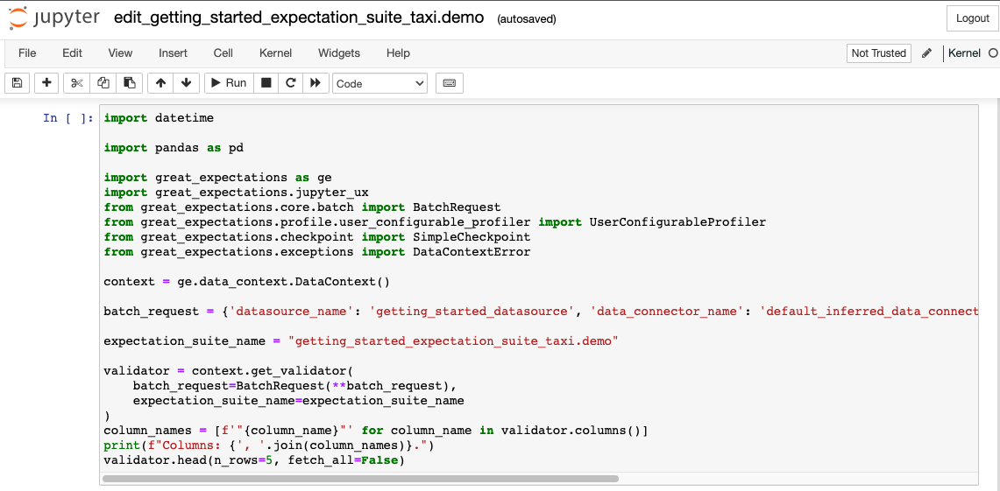
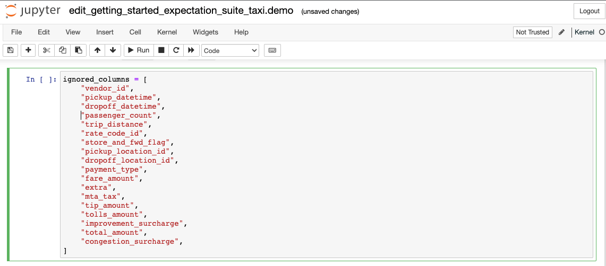
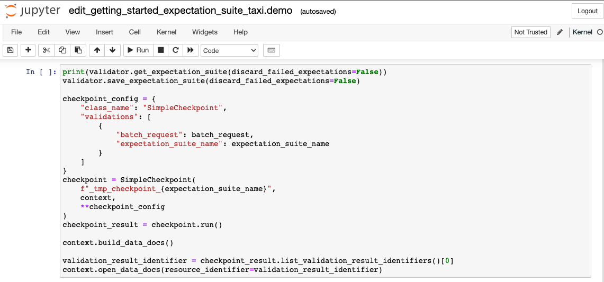

import UniversalMap from '/docs/images/universal_map/_universal_map.mdx';
import TechnicalTag from '/docs/term_tags/_tag.mdx';

<UniversalMap setup='inactive' connect='inactive' create='active' validate='inactive'/>

:::note Prerequisites

- Completed [Step 2: Connect to Data](./tutorial_connect_to_data.md) of this tutorial.

:::

<TechnicalTag relative="../../" tag="expectation" text="Expectations" /> are the workhorse abstraction in Great Expectations. Each Expectation is a declarative, machine-verifiable assertion about the expected format, content, or behavior of your data. Great Expectations comes with dozens of built-in Expectations, and it’s possible to develop your own custom Expectations, too.

The <TechnicalTag relative="../../" tag="cli" text="CLI" /> will help you create your first <TechnicalTag relative="../../" tag="expectation_suite" text="Expectation Suite" />. Suites are simply collections of Expectations. In order to create a new suite, we will use the built-in Data Assistant to automatically create an Expectation Suite called `getting_started_expectation_suite_taxi.demo`.

### Create an Expectation Suite using the CLI

Since we are using the CLI, you will want to return to your console and the `gx_tutorials` folder.  Remember: This is where we initialized our <TechnicalTag relative="../../" tag="data_context" text="Data Context" />, and the Data Context is our access point to everything else in Great Expectations!

From the `gx_tutorials` folder, type the following into your terminal:

```console
great_expectations suite new
```

This will bring up the following prompt:

```console
How would you like to create your Expectation Suite?
    1. Manually, without interacting with a sample Batch of data (default)
    2. Interactively, with a sample Batch of data
    3. Automatically, using a Data Assistant
: 3
```

In this tutorial we will be using a Data Assistant to populate the Expectation Suite, so go ahead and enter `3` and hit enter to continue to the next prompt.

```console
A batch of data is required to edit the suite - let's help you to specify it.


Which data asset (accessible by data connector "default_inferred_data_connector_name") would you like to use?
    1. yellow_tripdata_sample_2019-01.csv
    2. yellow_tripdata_sample_2019-02.csv
: 1
```
The Data Assistant will require a <TechnicalTag relative="../../" tag="batch" text="Batch" /> to analyze.  This prompt is asking us which data to use for that.  As you can see, the prompt it is giving corresponds to the .CSV files in our `data` folder.  These are the very same ones we configured our <TechnicalTag relative="../../" tag="datasource" text="Datasource" /> to connect to back in Step 2: Connect to Data.

We're going to choose the first file.  If you're wondering why, here's an explanation: Recall that our data directory contains two CSV files: `yellow_tripdata_sample_2019-01` and `yellow_tripdata_sample_2019-02`.

  - `yellow_tripdata_sample_2019-01` contains the January 2019 taxi data. Since we want to build an Expectation Suite based on what we know about our taxi data from the January 2019 data set, we want to use it for profiling.
  - `yellow_tripdata_sample_2019-02` contains the February 2019 data, which we consider the “new” data set that we want to validate before using in production. We’ll use it later when showing you how to validate data.

Makes sense, right?

Go ahead and answer `1` and hit enter now.  That will bring up the next prompt.

```console
Name the new Expectation Suite [yellow_tripdata_sample_2019-01.csv.warning]: getting_started_expectation_suite_taxi.demo
```

This prompt is asking for a name for our new Expectation Suite.  You can name it whatever you would like, but since this is the Getting Started Tutorial, we're demonstrating how to create an expectation suite, and we're using NYC taxi data we've used `getting_started_expectation_suite_taxi.demo` as the provided name.

Once you've provided a name for your Expectation Suite and hit enter, you will receive one more prompt.   This one will ask if you want to proceed with creating the Expectation Suite as you've specified so far:

```console
Great Expectations will create a notebook, containing code cells that select from available columns in your dataset and
generate expectations about them to demonstrate some examples of assertions you can make about your data.

When you run this notebook, Great Expectations will store these expectations in a new Expectation Suite "Name the new Expectation Suite [yellow_tripdata_sample_2019-01.csv.warning]: getting_started_expectation_suite_taxi.demo" here:

  <Path of your project folder>/gx_tutorials/great_expectations/expectations/Name the new Expectation Suite [yellow_tripdata_sample_2019-01/csv/warning]: getting_started_expectation_suite_taxi/demo.json

Would you like to proceed? [Y/n]: Y
```

When you answer with `Y` (or just press enter) Great Expectations will **open a Jupyter Notebook** that helps you populate the new suite.

### Creating Expectations in Jupyter Notebooks

Notebooks are a simple way of interacting with the Great Expectations Python API. You could also just write all this in plain Python code, but for convenience, Great Expectations provides you some boilerplate code in notebooks.

Since notebooks are often less permanent, creating Expectations in a notebook also helps reinforce that the source of truth about Expectations is the Expectation Suite, not the code that generates the Expectations.

### Let’s take a look through the notebook and see what’s happening in each cell

**Cell 1**


1. The first cell does several things: It imports all the relevant libraries, loads a Data Context, and creates a `Validator`, which combines a <TechnicalTag relative="../../" tag="batch_request" text="Batch Request" /> to define your batch of data, and an Expectation Suite.

**Cell 2**


2. The second cell allows you to specify which columns you want to **ignore** when creating Expectations. For our tutorial, we're going to ensure that the number of passengers recorded in our data is reasonable.  To do this, we'll want our Data Assistant to examine the `passenger_count` column and determine just what a reasonable range _is_ based on our January data. **Let’s comment just this one line to include it**:

```python file=../../../tests/integration/docusaurus/tutorials/getting-started/getting_started.py#L89-L108
```

**Cell 3**


3. Cell 3 is where you run a Data Assistant.  In this case, the assistant being used is the Onboarding Assistant, which will analyze the data provided by your Batch Request and create the relevant Expectations to add to your `taxi.demo` suite.

**Cell 4**


4. The last cell does several things again: It saves the Expectation Suite to disk, runs the <TechnicalTag relative="../../" tag="validation" text="Validation" /> against the loaded data batch, and then builds and opens Data Docs, so you can look at the Validation Results. *We will explain the validation step later in the next step, [Step 4: Validate Data](./tutorial_validate_data.md).*

For purposes of this tutorial, the default values in all of these cells (except for the second one, which we changed to include the `passenger_count` field) provide the configurations and execute the steps that we need them to.  So as long as you've made that one change, you're ready to continue.

**Let’s execute all the cells** and wait for Great Expectations to open a browser window with Data Docs, which will then let us see and edit the Expectations that were composed for us by the Data Assistant.

### Viewing your Expectations in Data Docs

Once the Data Assistant is done executing it will open up <TechnicalTag relative="../../" tag="data_docs" text="Data Docs" /> in your browser automatically.

Data Docs translate Expectations, <TechnicalTag relative="../../" tag="validation_result" text="Validation Results" />, and other metadata into clean, human-readable documentation. Automatically compiling your data documentation from your data tests in the form of Data Docs guarantees that your documentation will never go stale.  Feel free to take a moment to browse through the Expectations that the Data Assistant put together from the data that we provided it.

In particular, take a look at the Expectations that were created for the `passenger_count` field.  These are the rules that we will be comparing the February data against when we validate it in step four of this tutorial.

### How did we get those Expectations?

You can create and edit Expectations using several different workflows. Using a Data Assistant as we just did is one of the quickest options to get started with an Expectation Suite.

This Data Assistant connected to your data (using the Datasource you configured in the previous step), took a quick look at the contents of the data, and produced an initial set of Expectations. The Data Assistant considers the following properties, amongst others:

  - the data type of the column

  - simple statistics like column min, max, mean

  - the number of times values occur

  - the number of `NULL` values

These Expectations are not intended to be very smart. Instead, the goal is to quickly provide some good examples, so that you’re not starting from a blank slate.

<details>
  <summary>Creating Custom Expectations</summary>
  <div>
    <p>
      Later, you should also take a look at other workflows for <a href="https://docs.greatexpectations.io/docs/guides/expectations/creating_custom_expectations/overview/">creating Custom Expectations</a>. Creating Custom Expectations is an active area of work in the Great Expectations community. Stay tuned for improvements over time.
    </p>
  </div>
</details>

For the purposes of this tutorial, the Expectations created by the Data Assistant are all we need.  On to [Step 4: Validate your data](./tutorial_validate_data.md)!
